 
 
 **git **
**1. Vispeahen Kullanıcı Oluşturma**
Vispeahen'e kullanıcı adı ve şifre bilgisi ile giriş yapılabilmektedir. Vispeahen’e giriş yapacak kullanıcı aşağıdaki adımları izlemelidir.
* Web tarayıcıya Vispeahen’e giriş yapılacak url eklenir.

 * “Ücretsiz Kayıt Ol” seçeneği tıklanır.
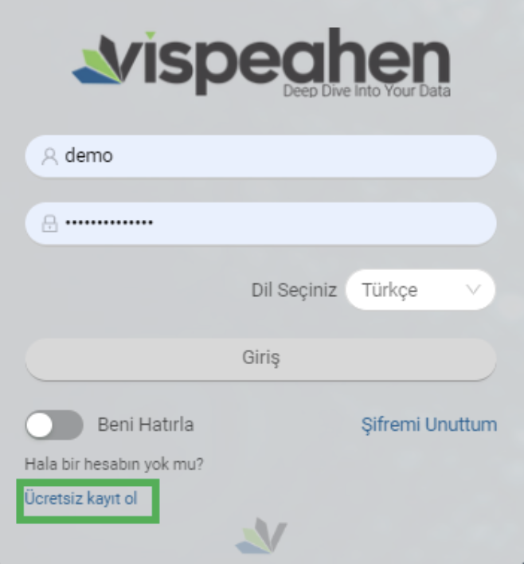

* Kayıt için gerekli bilgiler girilir, “Kayıt Ol” butonuna tıklanarak kullanıcı kaydı gerçekleştirilir.

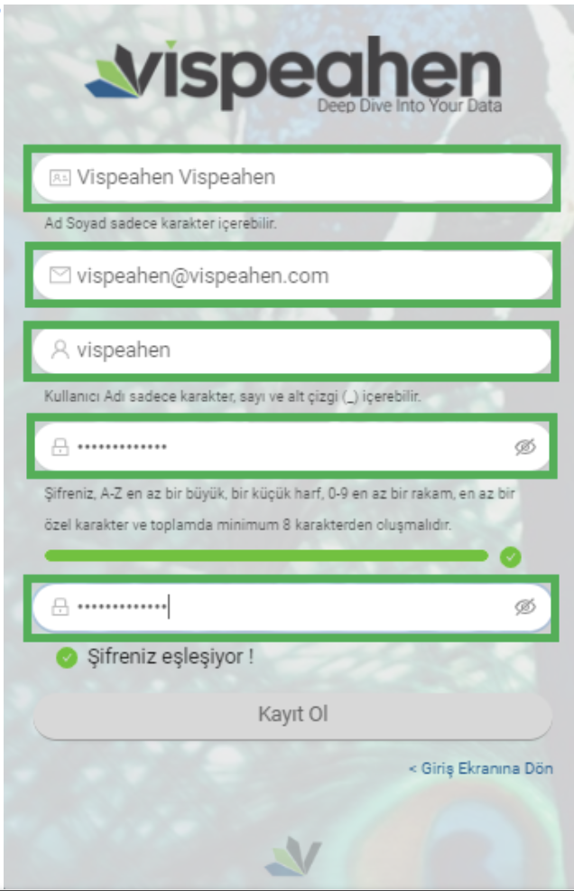

**2. Giriş Yapma**

* Vispeahen’e giriş yapmak için tarayıcıya belirlenen url eklenir. 

   Resim 1. Vispeahen Giriş Ekranı

* Açılan Vispeahen sayfasında kullanıcı adı ve şifre bilgisi girilir. 
* Tercih edilen dil seçilir. 
* “Giriş” butonuna tıklanarak giriş yapılır.

**3. Açılış Ekranı**

* Kullanıcı adı ve şifre bilgisi ile giriş yaptıktan sonra açılış ekranı gelmektedir. Kullanıcı ile ilk defa girişte ya da herhangi bir label seçilmediyse açılış ekranı yönlendirme metni ile gelmektedir.

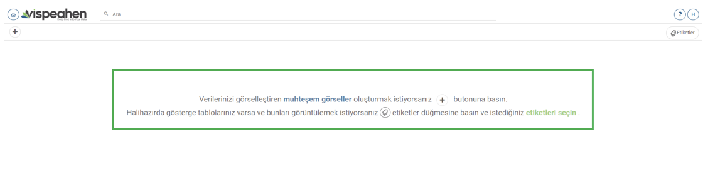

* Daha önce tanımlamış olduğu etiket varsa o etiketleri seçenekler arasında görüntüleyebilir.

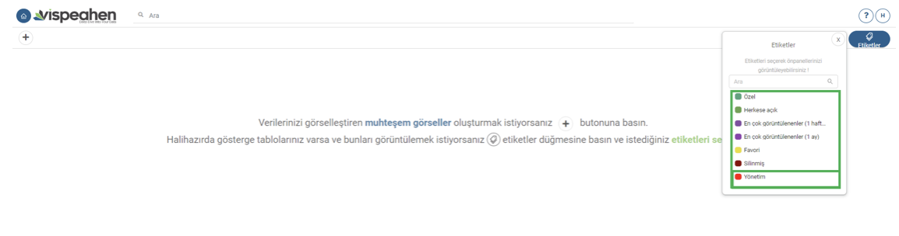

Kullanıcının yetkisine göre gelen etiketlerden seçim yapıldığında açılış ekranında seçilen etiketler ve ilgili etiketlere tanımlanan raporlar görüntülenmektedir.
* Seçilen label’a herhangi bir rapor tanımlanmamışsa “Bu etikette hiçbir rapor bulunamadı” uyarısı yer almaktadır. Kullanıcı etiket altında olmasını istediği raporlara ilgili etiketleri tanımlamalıdır.

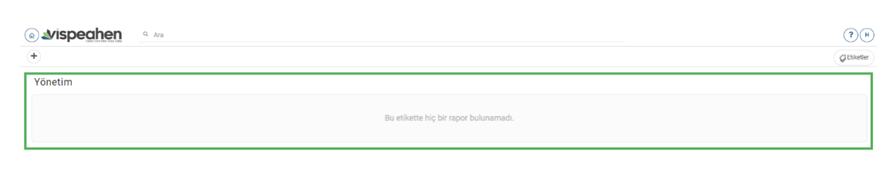

* Seçilen etikete rapor tanımlanmışsa tanımlanan raporlar ilgili etiket altında görüntülenmektedir.

Kullanıcı yetkisi dahilinde dashboardları “Arama” alanından arayabilmektedir. Yazmış olduğu metin ilk etapta rapor isimleri olmak üzere metadata da dahil olmak üzere gelişmiş arama özelliğine sahiptir. 
Arama yapılan rapor ön izlemeleri de yer almaktadır.

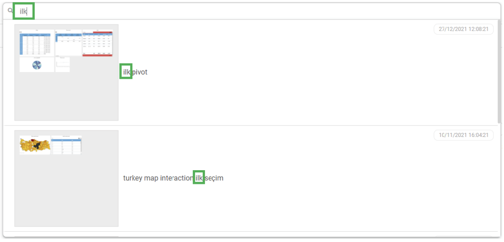

**4. Rapor Oluşturma Alanı**

Rapor açılış ekranının solunda bulunan “+” ikonuna tıklandığında yeni rapor oluşturma ekranına geçiş yapılmaktadır. (“+” ikonu yetki dâhilinde gelmektedir)

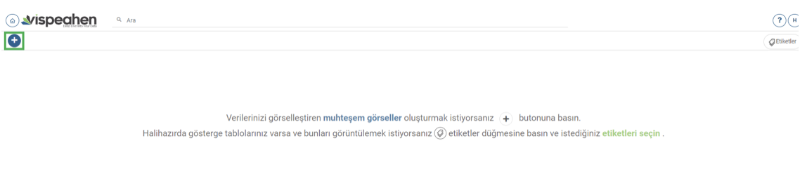

“+” ikonuna tıklandıktan sonra gelen ekran aşağıdadır:

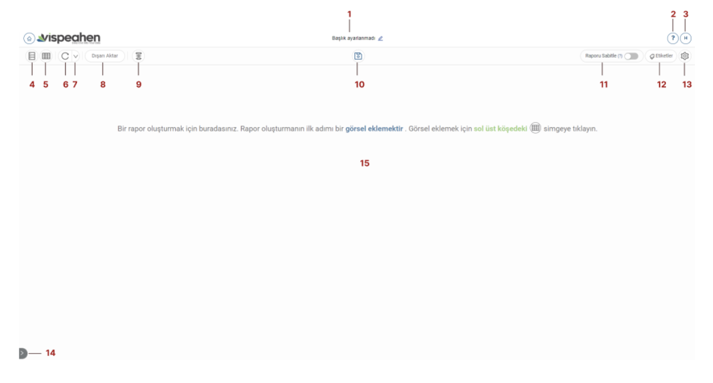

**1. Rapor Başlık Alanı:** Oluşturulan rapora verilen başlık bilgisinin yer aldığı alandır.
**2. Yardım (?) Alanı:** Vispeahen kullanımı için yardım dokümanının bulunduğu alandır.
**3. Profil Alanı:** Kullanıcı profil alanıdır. Yetki dâhilinde “Yönetim Paneli” sayfasına geçiş yapılabilmektedir.
**4. Model Alanı:** Modelleme ve veri kaynağının eklendiği alandır.
**5. Görsel Alanı:** Görsellerin listelendiği alandır.
**6. Yenile Alanı:** Raporun yenilendiği alandır.
**7. Otomatik Yenileme Alanı:** Belirlenen sürede raporun yenilendiği alandır.
**8. Dışarı Aktar Alanı:** Excel/Pdf/Png çıktısı alınan alandır.
**10. Kaydet Alanı:** Raporun kaydedilmesi/farklı kaydedilmesi alanıdır.
**11. Rapor Sabitle Alanı:** Görsel içinde uzaklaştırma/yakınlaştırma gibi özellikleri olan görseller için yeniden boyutlandırma özelliğini kapatmak için kullanılan alandır.
**12. Etiketler Alanı:** Raporun yer alacağı label’ın oluşturulduğu/seçildiği alandır.
**13. Ayarlar Alanı:** Raporun kişiselleştirilebilir (arkaplan rengi,gölge ekleme,…) özelliklerinin bulunduğu alandır.
**14. Rapor Geçiş Alanı:** Yetkili olunan labellar ve raporlar arasında kolay geçişin yapılabileceği alandır.
**15. Rapor Oluşturma Alanı:** Görsellerin eklendiği, düzenlemelerin yapıldığı alandır.
     
    4.1.Veri Kaynağı Ekleme
Veri kaynağı eklemek için önce model alanına tıklamak gerekir. 
Rapor oluşturma ekranı sol tarafında bulunan “Model” ikonuna tıklanır.

Modelleme alanında model ismi yazılarak “Oluştur” butonuna tıklanır.
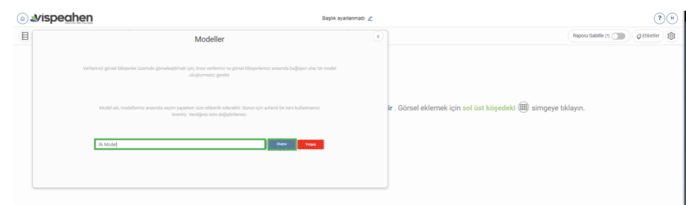

Yazılan model isminden sonra kullanıcıya yardımcı metni yer almaktadır. Veri kaynağı eklemek için “Hadi Başlayalım” butonuna tıklanarak devam edilir.

“Hadi Başlayalım” butonuna tıklandıktan sonra sağ tarafta yeni bir alan açılacaktır. 
Sağ tarafta açılan alanda;
* Dosya Yükleme: Veri kaynağı olarak dosya (csv/excel,..) yüklenen alandır.
* RDBMS/NoSQL: İlişkisel ya da nosql veri kaynaklarının eklendiği alandır. 

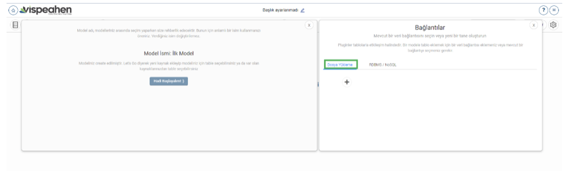

İlişkisel/NoSQL veri kaynağı eklemek için “+” ikonuna tıklanır.

Yeni veri kaynağı ekleme ikonuna tıklandığı zaman eklenebilecek veri kaynakları ikonları görülmektedir.
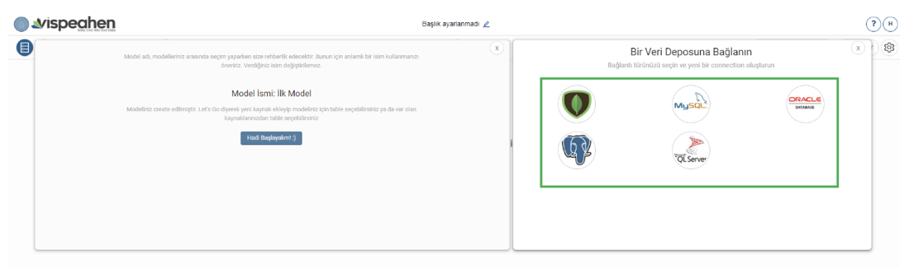

Eklemek için veri kaynağı seçimi yapıldığında veri kaynağı bağlantı bilgilerinin girilebileceği alan açılmaktadır. 

**1. Bağlantı için bir isim verin:** Eklenecek veri kaynağına verilecek isim alanıdır.
**2. Ip Adresi:** Veri kaynağı hostname bilgisidir.
**3. Port:** Veri kaynağı port alanıdır. (Default port lar otomatik olarak gelmekte eklenecek veri kaynağı farklı porta sahipse değiştirilebilmektedir)
**4.Veritabanı İsmi:** Veri kaynağı veritabanı isminin yazıldığı alandır.
**5. Şema İsmi:** Veri kaynağında bağlanılacak şema ismi alanıdır.
**6.Kullanıcı Adı:** Veri kaynağına bağlanılacak kullanıcı adı bilgisidir.
**7. Şifre:** Veri kaynağına bağlanılacak kullanıcıya ait şifre bilgisidir.
**8. Test Bağlantısı:** Belirtilen bağlantı bilgileri ile veri kaynağına bağlantının başarılı olup olmadığının kontrol edileceği alandır. (Veri kaynağına bağlantı sağlanması durumunda “Başarılı”, bağlantı sağlanmaması durumunda “Başarısız” olarak uyarı çıkacaktır.
**9. Kaydet:** Belirtilen bağlantı bilgileri test bağlantı alanından “Başarılı” olduğunda “Kaydet” butonu aktif olmakta ve belirtilen isimle bağlantı bilgileri kaydedilecektir.

    4.2. Modelleme Alanı
Veri kaynağı eklenmesi için model oluşturulması gerekmektedir. Model oluşturmanın nasıl yapıldığı veri kaynağı ekleme kısmında yer almıştır.
Veri kaynağı bağlantısı sağlandıktan sonra veri kaynağı “Yeni” olarak görüntülenmekte ve veri kaynağına ilişkin tablolar listelenmektedir.

* Kullanıcı isterse veri kaynağı ekleme alanının sağında bulunan silme ikonu ile veri kaynağını silebilir.
* Kullanıcı isterse veri kaynağı ekleme alanı sağında bulunan düzenleme ikonu ile veri kaynağına ilişkin bağlantı bilgilerini düzenleyebilir.
* Kullanıcı veri kaynağında yer alan “Arama” alanı ile veri kaynağında yer alan tabloları arayabilir.

Kullanıcı modelde yer almasını istediği tablolara tıklayarak modele istediği tabloları ekleyebilmektedir.

Oluşturulan modele eklenen tablolara tıklandığında tabloda yer alan kolonlar listelenmektedir.

Eklenen tabloda yer alan kolonların sağında bulunan üç noktaya tıklandığında kolonlara ilişkin işlemler yapılabilir.

**1.Kopyala:** Var olan kolonun aynısından ikinci bir kolon oluşturulmak istendiğinde kullanılır.
**2.Toplama Kuralı:** Kolona toplama kurallarından (aggregation rule) eklenmek istendiğinde tıklanacak alandır.

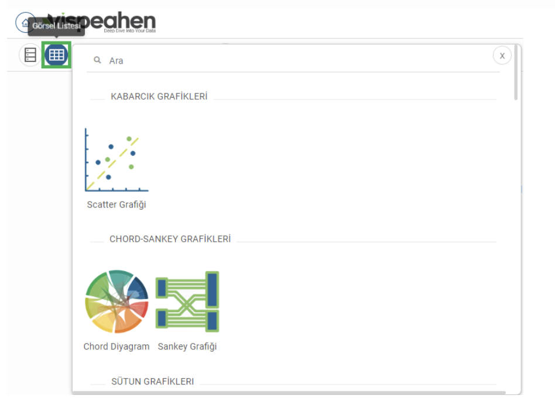

  4.3.1.Scatter Grafiği

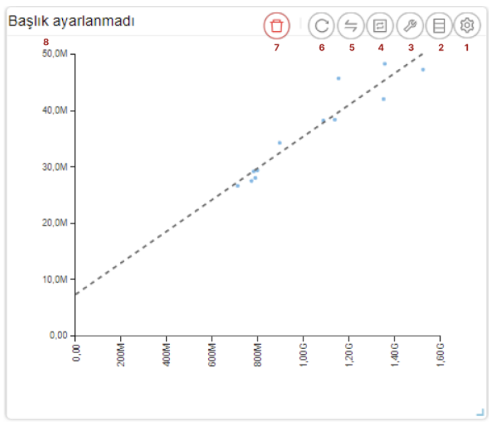

**1. Araçları Aç/Kapat:** Görsel ile ilgili düzenleme yapılan ikonların açıp kapatıldığı ikondur.
**2. Veri:** Kullanıcının kendi verileriyle görseli şekillendireceği alandır.
**3. Ayarlar:** Görselin renk/başlık gibi biçimsel özelliklerinin değiştirildiği alandır.
**4. Etkileşim:** Görselden diğer görsellere filtre verilen alandır.
**5. Navigasyon:** Görselden belirlenen parametreye göre navigasyon verilen alandır.
**6. Yenile:** Veri alanı ile grafiğin çalışması ve grafiğin yenilenmesini sağlar.
**7. Kaldır:** Görseli silmek için kullanılan alandır. “Kaldır” ikonuna tıklandığında “Bu görseli silmek istiyor musunuz?” şeklinde uyarı çıkmaktadır.
**Not:** Etkileşim-Navigasyon alanları grafiklerde ortak olduğundan ayrı başlıkta yer alacaktır.

**Scatter Grafiği Veri Alanı**

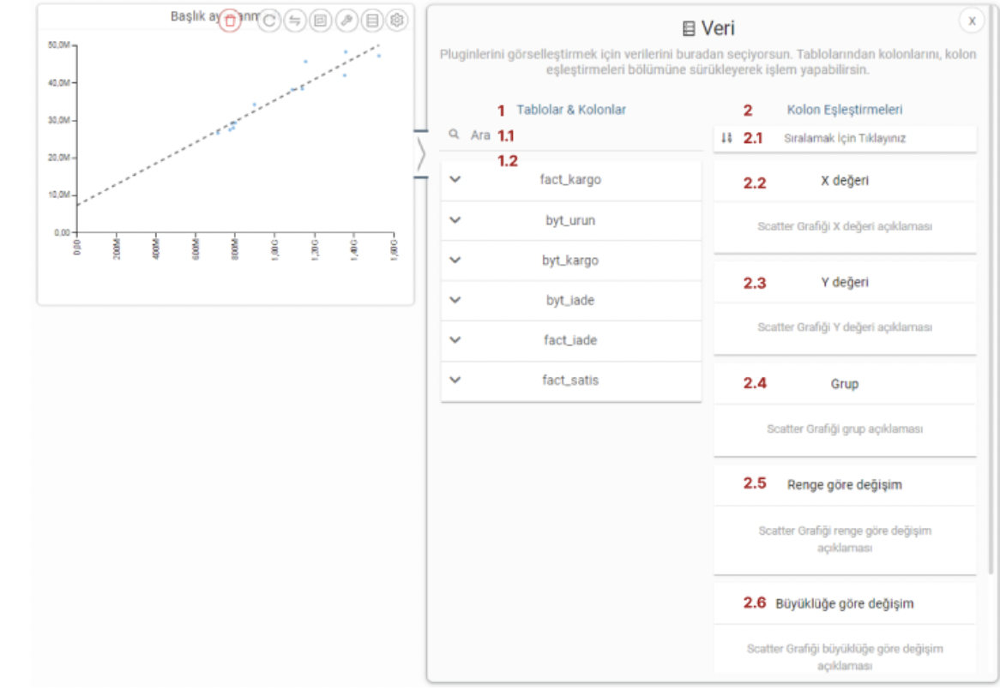

Tablolar & Kolonlar bölümünde yer alan kolonlar, sağ tarafta bulunan bölümlere sürükle-bırak ile eklenir.
1. **Ara:** Tablo ve kolonların arandığı alandır.
2. **Tablo Kolon Listesi:** Seçili modelde yer alan tablo ve kolonların yer aldığı bölümdür.

**2.Kolon Eşleştirmeleri**
2.1.**Sıralama:** Kolon verisinin artan/azalan şekilde sıralamasının yapıldığı alandır.
2.2.**X Değeri:** Grafiğin yatay alandaki sayısal değerin gösterileceği alandır.
2.3.**Y Değeri:** Grafiğin dikey alandaki sayısal değerin gösterileceği alandır.
2.4.**Grup:** Grafikte yer alan sayısal alanların kategorik olarak gruplanacağı veri alanıdır.
2.5.**Renge Göre Değişim:** Bu alandaki veriye göre renk değişikliğinin sağlanacağı alandır.
2.6.**Büyüklüğe Göre Değişim:** Bu alandaki veri değerine göre nokta boyutunun ayarlandığı alandır.

**Scatter Grafiği Ayarlar Alanı**

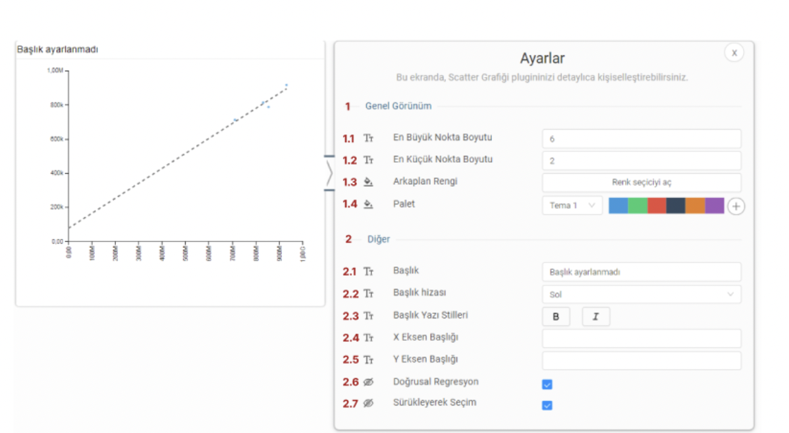

**1. Genel Görünüm**

1.**En Büyük Nokta Boyutu:**Grafiği oluşturan noktalardan değeri en büyük olanın boyutunun ayarlandığı alandır.
2.**En Küçük Nokta Boyutu:** Grafiği oluşturan noktalardan değeri en küçük olanın boyutunun ayarlandığı alandır.
3.**Arka Plan Rengi:** Grafiğe arka plan rengi verilen alandır. Paletten arka plan rengi seçilebilmektedir.
Palet
 4.1.  **Tema:** Grafik ön tanımlı temalar seçilerek görselleştirilir.
 4.2.  **Palet:** Grafik paletten seçilen renklere göre görselleştirilir.
**2. Diğer**
2.1. **Başlık:** Grafiğe başlık verilen alandır.
2.2. **Başlık Hizası:** Grafik başlığının sağ/orta/sol hizalamasının seçildiği alandır.
2.3.**Başlık Yazı Stilleri:**Grafik başlığının kalın/italik/altı çizili olmasının belirlendiği kısımdır.
2.4.**X Eksen Başlığı:** Grafiğin yatay alandaki başlığın düzenlendiği alandır.
2.5.**Y Eksen Başlığı:**Grafiğin dikey alandaki başlığın düzenlendiği alandır.
2.6. **Doğrusal Regresyon:** Grafikteki doğrusal çizginin eklenip eklenmeme durumu belirlenir.
2.7. **Sürükleyerek Seçim:** Grafik üzerindeki birden fazla noktanın alan olarak seçilme durumu belirlenir.

4.3.1.2.Chord Diagram

