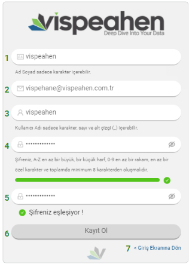
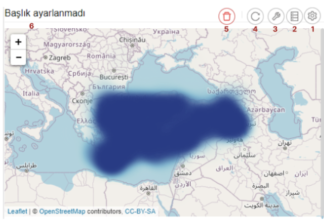
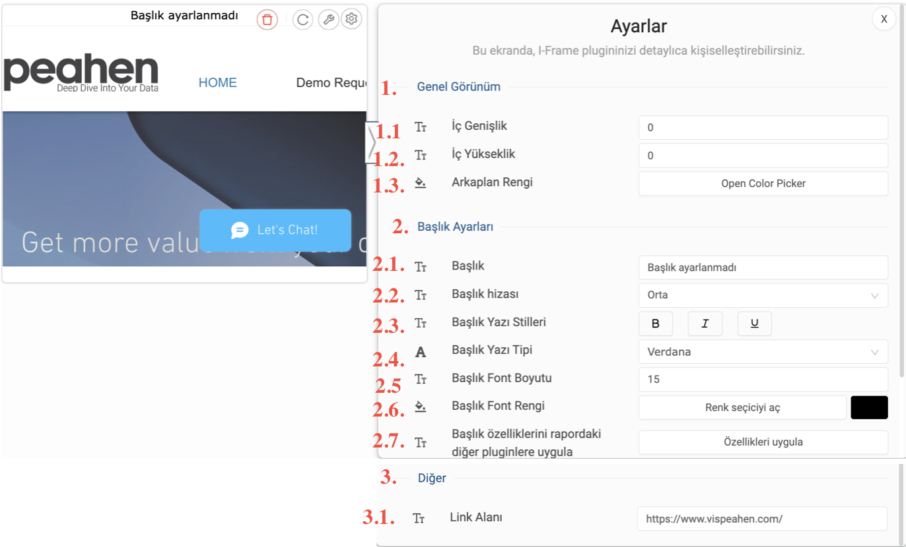

VISPEAHEN VERİ ANALİZ VE GÖRSELLEŞTİRME PLATFORMU
====================================================

**1. Vispeahen Kullanıcı Oluşturma**
====================================

Vispeahen’e giriş yapacak kullanıcı aşağıdaki adımları izlemelidir.

**1. Ad Soyad:** Vispeahen eklenecek kullanıcının isim soyisim bilgisinin girilebileceği alandır.

**2. E Posta:** Kullanıcı mail adresinin girileceği alandır.

**3. Kullanıcı Adı:** Vispeahen'de kullanılacak kullanıcı adının belirlendiği kısımdır. Kullanıcı adı belirlenirken sadece karakter, sayı ve alt çizgi (_) kullanımına izin verilmektedir.

**4. Şifre:** Vispeahen'e giriş yapılacak şifre bilgisinin girileceği alandır.

**5. Şifre Tekrar:** Şifrenin tekrar girileceği ve yukarıda girilen şifre ile uyuşup uyuşmadığının kontrol edileceği alandır.

**6. Kayıt Ol:** Bilgileri girilen kullanıcı bilgilerinin kaydedildiği kısımdır.

**7. Giriş Ekranına Dön:** Kullanıcı oluşturma ekranından giriş ekranına dönmek için kullanılacak kısımdır.

* **Not:** **Kayıt Ol** butonuna tıklandıktan sonra kullanıcıya aktivasyon maili gitmektedir. Kullanıcı mail adresinden aktivasyonu onayladıktan sonra sistem mail adresi ve şifresi ile giriş yapabilmektedir. 

**2. Giriş Yapma**
==================
*  Açılan Vispeahen sayfasında kullanıcı adı ve şifre bilgisi girilir.
*  Tercih edilen dil seçilir.
*  “Giriş” butonuna tıklanarak giriş yapılır.

**3. Açılış Ekranı**
====================
-  Kullanıcı adı ve şifre bilgisi ile giriş yaptıktan sonra açılış
   ekranı gelmektedir. Kullanıcı ile ilk defa girişte ya da herhangi bir
   label seçilmediyse açılış ekranı yönlendirme metni ile gelmektedir.

Resim 3. Vispeahen Açılış Ekranı

Kullanıcı açılış ekranında bulunan “Etiketler” ikonuna tıkladığında;

* İlk defa giriş yapıyorsa varsayılan olarak tanımlanan etiketler görüntülenir.

-  Daha önce tanımlamış olduğu etiket varsa o etiketleri seçenekler
   arasında görüntüleyebilir.
   
 .. figure:: ./images/111.png
   :alt: image
    

Kullanıcının yetkisine göre gelen etiketlerden seçim yapıldığında açılış
ekranında seçilen etiketler ve ilgili etiketlere tanımlanan raporlar
görüntülenmektedir.

* Seçilen label’a herhangi bir rapor tanımlanmamışsa “Bu etikette hiçbir rapor bulunamadı” uyarısı yer almaktadır. Kullanıcı etiket altında olmasını istediği raporlara ilgili etiketleri tanımlamalıdır.

.. figure:: ./images/112.png
   :alt: image

-  Seçilen etikete rapor tanımlanmışsa tanımlanan raporlar ilgili etiket
   altında görüntülenmektedir.

Kullanıcı yetkisi dahilinde dashboardları “Arama” alanından
arayabilmektedir. Yazmış olduğu metin ilk etapta rapor isimleri olmak
üzere metadata da dahil olmak üzere gelişmiş arama özelliğine sahiptir.

Arama yapılan rapor ön izlemeleri de yer almaktadır.

.. figure:: ./images/9.png
   :alt: image

**4. Rapor Oluşturma Ekranı**
=============================

Rapor açılış ekranının solunda bulunan “Yeni Kumanda Tablosu” ikonuna tıklandığında yeni rapor oluşturma ekranına geçiş yapılmaktadır. (“Yeni Kumanda Tablosu” ikonu yetki dâhilinde gelmektedir)

“Yeni Kumanda Tablosu” ikonuna tıklandıktan sonra gelen ekran aşağıdadır:

**1. Rapor Başlık Alanı:** Oluşturulan rapora verilen başlık bilgisinin
yer aldığı alandır.

**2. Ana Sayfaya Dönüş Alanı:** Kullanıcının ana sayfaya dönmesini sağlar.

**3. Yardım Alanı:** Vispeahen kullanımı için
yardım dokümanının bulunduğu alandır.

**4. Profil Alanı:** Kullanıcı
profil alanıdır. Yetki dâhilinde “Yönetim Paneli” sayfasına geçiş
yapılabilmektedir.

**5. Model Alanı:** Modelleme ve veri kaynağının
eklendiği alandır.

**6. Görsel Alanı:** Görsellerin listelendiği
alandır.

**7. Yenile Alanı:** Raporun yenilendiği alandır.

**8. Otomatik Yenileme Alanı:** Belirlenen sürede raporun yenilendiği alandır.

**9.Dışarı Aktar Alanı:** Excel/Pdf/Png çıktısı alınan alandır.

**10. What If Alanı:**

**11. Kaydet Alanı:** Raporun kaydedilmesi/farklı kaydedilmesi alanıdır.

**12. Rapor Sabitle Alanı:** Görsel içinde uzaklaştırma/yakınlaştırma gibi
özellikleri olan görseller için yeniden boyutlandırma özelliğini kapatmak için kullanılan alandır.

**13. Etiketler Alanı:** Raporun yer alacağı label’ın oluşturulduğu/seçildiği alandır.

**14. Ayarlar Alanı:** Raporun kişiselleştirilebilir (arkaplan rengi,gölge ekleme,…)
özelliklerinin bulunduğu alandır.

**15. Rapor Geçiş Alanı:** Yetkili olunan labellar ve raporlar arasında kolay geçişin yapılabileceği
alandır.

**16. Rapor Oluşturma Alanı:** Görsellerin eklendiği, düzenlemelerin yapıldığı alandır.

::

4.1.Veri Kaynağı Ekleme
=======================

Veri kaynağı eklemek için önce model alanına tıklamak gerekir. Rapor
oluşturma ekranı sol tarafında bulunan “Model” ikonuna tıklanır.

Modelleme alanında model ismi yazılarak “Oluştur” butonuna tıklanır.

.. figure:: ./images/13.png
   :alt: image

Yazılan model isminden sonra kullanıcıya yardımcı metni yer almaktadır.
Veri kaynağı eklemek için “Hadi Başlayalım” butonuna tıklanarak devam
edilir.

“Hadi Başlayalım” butonuna tıklandıktan sonra sağ tarafta yeni bir alan
açılacaktır. Sağ tarafta açılan alanda;

* Dosya Yükleme: Veri kaynağı olarak dosya (csv/excel,..) yüklenen alandır.
*  RDBMS/NoSQL: İlişkisel ya da nosql veri kaynaklarının eklendiği alandır.

.. figure:: ./images/15.png
   :alt: image

İlişkisel/NoSQL veri kaynağı eklemek için “+” ikonuna tıklanır.

Yeni veri kaynağı ekleme ikonuna tıklandığı zaman eklenebilecek veri
kaynakları ikonları görülmektedir.

.. figure:: ./images/17.png
   :alt: image

Eklemek için veri kaynağı seçimi yapıldığında veri kaynağı bağlantı
bilgilerinin girilebileceği alan açılmaktadır.

**1. Bağlantı için bir isim verin:** Eklenecek veri kaynağına verilecek
isim alanıdır.

**2. Ip Adresi:** Veri kaynağı hostname bilgisidir.

**3.Port:** Veri kaynağı port alanıdır. (Default port lar otomatik olarak gelmekte eklenecek veri kaynağı farklı porta sahipse
değiştirilebilmektedir)

**4.Veritabanı İsmi:** Veri kaynağı veritabanı isminin yazıldığı alandır.

**5. Şema İsmi:** Veri kaynağında bağlanılacak şema ismi alanıdır.

**6.Kullanıcı Adı:** Veri kaynağına bağlanılacak kullanıcı adı bilgisidir.

**7. Şifre:** Veri kaynağına bağlanılacak kullanıcıya ait şifre bilgisidir.

**8. Test Bağlantısı:** Belirtilen bağlantı bilgileri ile veri kaynağına bağlantının başarılı
olup olmadığının kontrol edileceği alandır. (Veri kaynağına bağlantı sağlanması durumunda “Başarılı”,
bağlantı sağlanmaması durumunda “Başarısız” olarak uyarı çıkacaktır.

**9. Kaydet:** Belirtilen bağlantı bilgileri test bağlantı alanından “Başarılı” olduğunda “Kaydet” butonu
aktif olmakta ve belirtilen isimle bağlantı bilgileri kaydedilecektir.

::

4.2. Modelleme Alanı
====================
Veri kaynağı eklenmesi için model oluşturulması gerekmektedir. Model
oluşturmanın nasıl yapıldığı veri kaynağı ekleme kısmında yer almıştır.
Veri kaynağı bağlantısı sağlandıktan sonra veri kaynağı “Yeni” olarak
görüntülenmekte ve veri kaynağına ilişkin tablolar listelenmektedir.

-  Kullanıcı isterse veri kaynağı ekleme alanının sağında bulunan silme
   ikonu ile veri kaynağını silebilir.
-  Kullanıcı isterse veri kaynağı ekleme alanı sağında bulunan düzenleme
   ikonu ile veri kaynağına ilişkin bağlantı bilgilerini düzenleyebilir.
-  Kullanıcı veri kaynağında yer alan “Arama” alanı ile veri kaynağında
   yer alan tabloları arayabilir.

Kullanıcı modelde yer almasını istediği tablolara tıklayarak modele
istediği tabloları ekleyebilmektedir.

Oluşturulan modele eklenen tablolara tıklandığında tabloda yer alan
kolonlar listelenmektedir.

Eklenen tabloda yer alan kolonların sağında bulunan üç noktaya
tıklandığında kolonlara ilişkin işlemler yapılabilir.

**1.Kopyala:** Var olan kolonun aynısından ikinci bir kolon oluşturulmak
istendiğinde kullanılır.

**2.Toplama Kuralı:** Kolona toplama kurallarından (aggregation rule) eklenmek istendiğinde tıklanacak
alandır.

**3.Bilgi:** Kolon bilgisi alanıdır.
   
**4.Adını Değiştir:** Kolonun görünür isminin değiştirildiği kısımdır.“Kaydet” butonuna tıklanarak yapılan değişiklikler kaydedilir.

4.3. **Rapor Oluşturma**
=========================

Etkileşimli raporlar oluşturmak için görsellerin rapor alanına eklenmesi gerekir.

**4.3.1. Görsel Listesi**
==========================

Görselleştirme için “Görsel Listesi” ikonuna tıklanarak görseller eklenir.

.. figure:: ./images/23.png
   :alt: image

4.3.1.Scatter Grafiği
=====================

**1. Araçları Aç/Kapat:** Görsel ile ilgili düzenleme yapılan ikonların
açıp kapatıldığı ikondur.

**2. Veri:** Kullanıcının kendi verileriyle görseli şekillendireceği alandır.

**3. Ayarlar:** Görselin renk/başlık gibi biçimsel özelliklerinin değiştirildiği alandır.

**4. Etkileşim:** Görselden diğer görsellere filtre verilen alandır.

**5. Navigasyon:** Görselden belirlenen parametreye göre navigasyon verilen alandır.

**6.Yenile:** Veri alanı ile grafiğin çalışması ve grafiğin yenilenmesini sağlar.

**7. Kaldır:** Görseli silmek için kullanılan alandır. “Kaldır” ikonuna tıklandığında “Bu görseli silmek istiyor musunuz?” şeklinde
uyarı çıkmaktadır.

**8. Başlık Alanı:** Grafiğin isimlendirildiği bölümdür. 

**Not:** Etkileşim-Navigasyon alanları grafiklerde
ortak olduğundan ayrı başlıkta yer alacaktır.

**Scatter Grafiği Veri Alanı**

.. figure:: ./images/25.png
   :alt: image

Tablolar & Kolonlar bölümünde yer alan kolonlar, sağ tarafta bulunan
bölümlere sürükle-bırak ile eklenir.

**1. Tablolar ve Kolonlar** 

  1.1. **Ara:** Tablo ve kolonların arandığı alandır.
  
  1.2. **Tablo Kolon Listesi:** Seçili modelde yer alan
tablo ve kolonların yer aldığı bölümdür.

**2.Kolon Eşleştirmeleri**

    2.1.\ **Sıralama:** Kolon verisinin artan/azalan şekilde sıralamasının yapıldığı alandır.

    2.2.\ **X Değeri:** Grafiğin yatay alandaki sayısal değerin gösterileceği alandır.

    2.3.\ **Y Değeri:** Grafiğin dikey alandaki sayısal değerin gösterileceği alandır.

    2.4.\ **Grup:** Grafikte yer alan sayısal alanların kategorik olarak gruplanacağı veri alanıdır.

    2.5.\ **Renge Göre Değişim:** Bu alandaki veriye göre renk değişikliğinin sağlanacağı alandır.

    2.6.\ **Büyüklüğe Göre Değişim:** Bu alandaki veri değerine göre nokta boyutunun ayarlandığı alandır.

**Scatter Grafiği Ayarlar Alanı**

**1. Genel Görünüm**

  1.1. **En Büyük Nokta Boyutu:** Grafiği oluşturan noktalardan değeri en
büyük olanın boyutunun ayarlandığı alandır.

  1.2. **En Küçük Nokta Boyutu:** Grafiği oluşturan noktalardan değeri en küçük olanın boyutunun
ayarlandığı alandır.

  1.3. **Arka Plan Rengi:** Grafiğe arka plan rengi verilen alandır. Paletten arka plan rengi seçilebilmektedir.

  1.4. **Palet:** Grafiğin rengi bu alanda seçilebilmektedir.

   1.4.1. **Tema:** Grafik ön tanımlı temalar seçilerek görselleştirilir.

   1.4.2. **Palet:** Grafik paletten seçilen renklere göre görselleştirilir.

**2. Başlık ayarları**

  2.1. **Başlık:** Grafiğin başlığının belirtildiği alandır.

  2.2. **Başlık Hizası:** Başlık orta, sağ veya sol olmak üzere istenen şekilde hizalama yapılabilir.

  2.3. **Başlık Yazı Stilleri:** Başlığın yazı stili seçilebilmektedir.

  2.4. **Başlık Yazı Tipi:** Bu alanda başlığın yazı tipi belirlenebilmektedir. 

  2.5. **Başlık Font Boyutu:** Başlıkğın font boyutu burada seçilmektedir.

  2.6. **Başlık Font Rengi:** Font renk seçime imkanı sunar.

  2.7. **Başlık Özelliklerini Rapordaki Diğer Pluginlere Uygulama Alanı:** Başlığa dair yapılmış olan tüm düzenlemeleri raporda bulunan diğer plugin başlıklarına uygulanmasını sağlamaktadır.

**3. Diğer**

  3.1. **X Eksen Başlığı:** Grafiğin yatay alandaki başlığın düzenlendiği alandır.
  
  3.2. **Y Eksen Başlığı:** Grafiğin dikey alandaki başlığın düzenlendiği alandır. 
  
  3.3. **Doğrusal Regresyon:** Grafikteki doğrusal çizginin eklenip eklenmeme durumu belirlenir.

  3.4. **Sürükleyerek Seçim:** Grafik üzerindeki birden fazla noktanın alan olarak seçilme
durumu belirlenir.

4.3.1.2.Chord Diagram
======================

.. figure:: ./images/27.png
   :alt: image

1. **Araçları Aç/Kapat:** Görsel ile ilgili düzenleme yapılan ikonların açıp kapatıldığı ikondur.

#. **Veri:** Kullanıcının kendi verileriyle görseli şekillendireceği alandır.

#. **Ayarlar:** Görselin renk/başlık gibi biçimsel özelliklerinin değiştirildiği alandır.

#. **Etkileşim:** Görselden diğer görsellere filtre verilen alandır.

#. **Navigasyon:** Görselden belirlenen parametreye göre navigasyon verilen alandır.

#. **Yenile:** Veri alanı ile grafiğin çalışması ve grafiğin yenilenmesini sağlar.

#. **Kaldır:** Görseli silmek için kullanılan alandır. “Kaldır” ikonuna tıklandığında “Bu görseli silmek istiyor musunuz?” şeklinde uyarı çıkmaktadır.

#. **Başlık:** Grafiğe başlık verilen alandır.

**Not:** Etkileşim-Navigasyon alanları grafiklerde ortak olduğundan ayrı başlıkta yer alacaktır.

**Chord Diagram Veri Alanı**

**1.Tablolar ve Kolonlar**

Seçili modelde var olan tablo ve kolonların bulunduğu alandır.

Tablolar & Kolonlar bölümünde yer alan kolonlar, sağ tarafta bulunan bölümlere sürükle-bırak ile eklenir.

1.1. **Ara:** Tablo ve kolonların arandığı alandır.

1.2. **Tablo Kolon Listesi:** Seçili modelde yer alan tablo ve kolonların yer aldığı bölümdür.

**2.Kolon Eşleştirmeleri**

2.1. **Sıralama:** Kolon verisinin artan/azalan şekilde sıralamasının yapıldığı alandır.

2.2. **Varlıklar:** Grafiğin kategorik alana göre değişiminin görselleştirilmesi için en az iki kategorik verinin eklendiği alandır.

2.3. **Ölçü Değeri:** Grafiği şekillendirmek için kullanılacak sayısal verinin eklendiği alandır.

**Chord Diagram Ayarlar Alanı**

**1.Genel Görünüm**

 1.1. **Arka Plan Rengi:** Grafiğe arka plan rengi verilen alandır. Paletten arka plan rengi seçilebilmektedir.

 1.2. **Palet**

   1.2.1. **Tema:** Grafik ön tanımlı temalar seçilerek görselleştirilir.

   1.2.2. **Palet:** Grafik paletten seçilen renklere göre görselleştirilir.

**2. Başlık ayarları**

  2.1. **Başlık:** Grafiğin başlığının belirtildiği alandır.

  2.2. **Başlık Hizası:** Başlık orta, sağ veya sol olmak üzere istenen şekilde hizalama yapılabilir.

  2.3. **Başlık Yazı Stilleri:** Başlığın yazı stili seçilebilmektedir.

  2.4. **Başlık Yazı Tipi:** Bu alanda başlığın yazı tipi belirlenebilmektedir. 

  2.5. **Başlık Font Boyutu:** Başlıkğın font boyutu burada seçilmektedir.

  2.6. **Başlık Font Rengi:** Font renk seçime imkanı sunar.

  2.7. **Başlık Özelliklerini Rapordaki Diğer Pluginlere Uygulama Alanı:** Başlığa dair yapılmış olan tüm düzenlemeleri raporda bulunan diğer plugin başlıklarına uygulanmasını sağlamaktadır.

4.3.1.3. Sankey grafiği
=======================

**1. Araçları Aç/Kapat:** Görsel ile ilgili düzenleme yapılan ikonların açıp kapatıldığı ikondur.

**2. Veri:** Kullanıcının kendi verileriyle görseli şekillendireceği alandır.

**3. Ayarlar:** Görselin renk/başlık gibi biçimsel özelliklerinin değiştirildiği alandır.

**4. Etkileşim:** Görselden diğer görsellere filtre verilen alandır.

**5. Navigasyon:** Görselden belirlenen parametreye göre navigasyon verilen alandır.

**6. Yenile:** Veri alanı ile grafiğin çalışması ve grafiğin yenilenmesini sağlar.

**7. Kaldır:** Görseli silmek için kullanılan alandır. “Kaldır” ikonuna tıklandığında “Bu görseli silmek istiyor musunuz?” şeklinde uyarı çıkmaktadır.

**8. Başlık:** Başlık: Grafiğe başlık verilen alandır.

**Not:** Etkileşim-Navigasyon alanları grafiklerde ortak olduğundan ayrı başlıkta yer alacaktır.

**Sankey Grafiği Veri Alanı**

**1. Tablolar ve Kolonlar**

Seçili modelde var olan tablo ve kolonların bulunduğu alandır.
Tablolar & Kolonlar bölümünde yer alan kolonlar, sağ tarafta bulunan bölümlere sürükle-bırak ile eklenir.

1.1. **Ara:** Tablo ve kolonların arandığı alandır.

1.2. **Tablo Kolon Listesi:** Seçili modelde yer alan tablo ve kolonların yer aldığı bölümdür.

**2. Kolon Eşlelştirmeleri**

2.1. **Sıralama:** Kolon verisinin artan/azalan şekilde sıralamasının yapıldığı alandır.

2.2. **Seviye:** Grafiğin kategorik alana göre değişiminin görselleştirilmesi için en az iki kategorik verinin eklendiği alandır.

2.3. **Ölçü Değeri:** Grafiği şekillendirmek için kullanılacak sayısal verinin eklendiği alandır.

**Sankey Grafiği Ayarlar Alanı**

**1.Genel Görünüm**

1.1. **Arka Plan Rengi:** Grafiğe arka plan rengi verilen alandır. Paletten arka plan rengi seçilebilmektedir.

1.2. **Palet**

 1.2.1. **Tema:** Grafik ön tanımlı temalar seçilerek görselleştirilir.

 1.2.2. **Palet:** Grafik paletten seçilen renklere göre görselleştirilir.

**2. Başlık ayarları**

  2.1. **Başlık:** Grafiğin başlığının belirtildiği alandır.

  2.2. **Başlık Hizası:** Başlık orta, sağ veya sol olmak üzere istenen şekilde hizalama yapılabilir.

  2.3. **Başlık Yazı Stilleri:** Başlığın yazı stili seçilebilmektedir.

  2.4. **Başlık Yazı Tipi:** Bu alanda başlığın yazı tipi belirlenebilmektedir. 

  2.5. **Başlık Font Boyutu:** Başlıkğın font boyutu burada seçilmektedir.

  2.6. **Başlık Font Rengi:** Font renk seçime imkanı sunar.

  2.7. **Başlık Özelliklerini Rapordaki Diğer Pluginlere Uygulama Alanı:** Başlığa dair yapılmış olan tüm düzenlemeleri raporda bulunan diğer plugin başlıklarına uygulanmasını sağlamaktadır.

4.3.1.4. Silindir Bar Grafiği
==============================

**1.Araçları Aç/Kapat:** Görsel ile ilgili düzenleme yapılan ikonların açıp kapatıldığı ikondur.

**2.Veri:** Kullanıcının kendi verileriyle görseli şekillendireceği alandır.

**3.Ayarlar:** Görselin renk/başlık gibi biçimsel özelliklerinin değiştirildiği alandır.

**4. Yenile:** Veri alanı ile grafiğin çalışması ve grafiğin yenilenmesini sağlar.

**5.Kaldır:** Görseli silmek için kullanılan alandır. “Kaldır” ikonuna tıklandığında “Bu görseli silmek istiyor musunuz?” şeklinde uyarı çıkmaktadır.

**6.Başlık:** Grafiğe başlık verilen alandır.

**Silindir Bar Grafiği Veri Alanı**

**1.Tablolar & Kolonlar**
Seçili modelde var olan tablo ve kolonların bulunduğu alandır.
Tablolar & Kolonlar bölümünde yer alan kolonlar, sağ tarafta bulunan bölümlere sürükle-bırak ile eklenir.
   1.1. **Ara:** Tablo ve kolonların arandığı alandır.
   
   
   1.2. **Tablo Kolon Listesi:** Seçili modelde yer alan tablo ve kolonların yer aldığı bölümdür.

**2.Kolon Eşleştirmeleri**
  
  2.1. **Sıralama:** Kolon verisinin artan/azalan şekilde sıralamasının yapıldığı alandır.
  
  2.2. **Etiket:** Grafiğin kategorik alana göre değişiminin görselleştirilmesi için verinin eklendiği alandır.
  
  2.3. **Değerler:** Grafiği şekillendirmek için kullanılacak sayısal veri/verilerin eklendiği alandır.
 
**Silindir Bar Grafiği Ayarlar Alanı**

**1. Başlık ayarları**

  1.1. **Başlık:** Grafiğin başlığının belirtildiği alandır.

  1.2. **Başlık Hizası:** Başlık orta, sağ veya sol olmak üzere istenen şekilde hizalama yapılabilir.

  1.3. **Başlık Yazı Stilleri:** Başlığın yazı stili seçilebilmektedir.

  1.4. **Başlık Yazı Tipi:** Bu alanda başlığın yazı tipi belirlenebilmektedir. 

  1.5. **Başlık Font Boyutu:** Başlıkğın font boyutu burada seçilmektedir.

  1.6. **Başlık Font Rengi:** Font renk seçime imkanı sunar.

  1.7. **Başlık Özelliklerini Rapordaki Diğer Pluginlere Uygulama Alanı:** Başlığa dair yapılmış olan tüm düzenlemeleri raporda bulunan diğer plugin başlıklarına uygulanmasını sağlamaktadır.

**2.Diğer**

 2.1. **Arkaplan Rengi:** Grafiğe arka plan rengi verilen alandır

4.3.1.5. Yaş Piramidi
=====================

.. figure:: ./images/121.png
   :alt: image

**1. Araçları Aç/Kapat:** Görsel ile ilgili düzenleme yapılan ikonların açıp kapatıldığı ikondur.

**2. Veri:** Kullanıcının kendi verileriyle görseli şekillendireceği alandır.

**3.Ayarlar:** Görselin renk/başlık gibi biçimsel özelliklerinin değiştirildiği alandır.

**4.Navigasyon:** Görselden belirlenen parametreye göre navigasyon verilen alandır.

**5.Yenile:** Veri alanı ile grafiğin çalışması ve grafiğin yenilenmesini sağlar.

**6.Kaldır:** Görseli silmek için kullanılan alandır. “Kaldır” ikonuna tıklandığında “Bu görseli silmek istiyor musunuz?” şeklinde uyarı çıkmaktadır.

**7.Başlık:** Grafiğe başlık verilen alandır.

**Yaş Piramidi Veri Alanı**

**1.Tablolar & Kolonlar**

Seçili modelde var olan tablo ve kolonların bulunduğu alandır.
Tablolar & Kolonlar bölümünde yer alan kolonlar, sağ tarafta bulunan bölümlere sürükle-bırak ile eklenir.

1.1. **Ara:** Tablo ve kolonların arandığı alandır.

1.2. **Tablo Kolon Listesi:** Seçili modelde yer alan tablo ve kolonların yer aldığı bölümdür.

**2.Kolon Eşleştirmeleri**

2.1. **Sıralama:** Kolon verisinin artan/azalan şekilde sıralamasının yapıldığı alandır.

2.2. **Kategori:** Grafiğin kategorik alana göre değişiminin görselleştirilmesi için kategorik verinin eklendiği alandır.

2.3. **Ölçü Değeri 1:** Grafiğin sağında yer alan sayısal verinin eklendiği alandır.

2.4. **Ölçü Değeri 2:** Grafiğin solunda yer alan sayısal verinin eklendiği alandır.

2.5. **Saklı Alan:** Grafikte gösterilmeyen default filtrede, formülde kullanılmak üzere verinin eklendiği alandır.

**Yaş Piramidi Ayarlar Alanı**

 **1.Genel Görünüm**

1.1. **Arka Plan Rengi:** Grafiğe arka plan rengi verilen alandır. Paletten arka plan rengi seçilebilmektedir.

1.2. **Palet**

   1.2.1. **Tema:** Grafik ön tanımlı temalar seçilerek görselleştirilir.

   1.2.2. **Palet:** Grafik paletten seçilen renklere göre görselleştirilir.

**2. Başlık ayarları**

  2.1. **Başlık:** Grafiğin başlığının belirtildiği alandır.

  2.2. **Başlık Hizası:** Başlık orta, sağ veya sol olmak üzere istenen şekilde hizalama yapılabilir.

  2.3. **Başlık Yazı Stilleri:** Başlığın yazı stili seçilebilmektedir.

  2.4. **Başlık Yazı Tipi:** Bu alanda başlığın yazı tipi belirlenebilmektedir. 

  2.5. **Başlık Font Boyutu:** Başlıkğın font boyutu burada seçilmektedir.

  2.6. **Başlık Font Rengi:** Font renk seçime imkanı sunar.

  2.7. **Başlık Özelliklerini Rapordaki Diğer Pluginlere Uygulama Alanı:** Başlığa dair yapılmış olan tüm düzenlemeleri raporda bulunan diğer plugin başlıklarına uygulanmasını sağlamaktadır.
           
4.3.1.6.Çok Eksenli Grafik
===========================

**1. Araçları Aç/Kapat:** Görsel ile ilgili düzenleme yapılan ikonların açıp kapatıldığı ikondur.

**2. Veri:** Kullanıcının kendi verileriyle görseli şekillendireceği alandır.

**3. Ayarlar:** Görselin renk/başlık gibi biçimsel özelliklerinin değiştirildiği alandır.

**4. Koşulsal Formatlama:** Grafik üzerinde tanımlanan belirli bir kural neticesinde verileri gözle daha kolay bir şekilde taramak için renksel ya da şekilsel biçimlendirmeler yapılan alandır.

**5. Etkileşim:** Görselden diğer görsellere filtre verilen alandır.

**6. Navigasyon:** Görselden belirlenen parametreye göre navigasyon verilen alandır.

**7. Yenile:** Veri alanı ile grafiğin çalışması ve grafiğin yenilenmesini sağlar.

**8. Kaldır:** Görseli silmek için kullanılan alandır. “Kaldır” ikonuna tıklandığında “Bu görseli silmek istiyor musunuz?” şeklinde uyarı çıkmaktadır.

**9. Başlık:** Grafiğe başlık verilen alandır.

**Not:** Koşulsal Formatlama-Etkileşim-Navigasyon alanları grafiklerde ortak olduğundan ayrı başlıkta yer alacaktır.

**Çok Eksenli Grafik Veri Alanı**

**1. Tablolar & Kolonlar**

Seçili modelde var olan tablo ve kolonların bulunduğu alandır.

Tablolar & Kolonlar bölümünde yer alan kolonlar, sağ tarafta bulunan bölümlere sürükle-bırak ile eklenir.

1.1. **Ara:** Tablo ve kolonların arandığı alandır.

1.2. **Tablo Kolon Listesi:** Seçili modelde yer alan tablo ve kolonların yer aldığı bölümdür.

**2. Kolon Eşleştirmeleri**

 2.1. **Sıralama:** Kolon verisinin artan/azalan şekilde sıralamasının yapıldığı alandır.
 
 2.2. **Kategori:** Grafiğin kategorik alana göre değişiminin görselleştirilmesi için kategorik verinin eklendiği alandır.
 
 2.3. **Kolonlar:** Grafikte çubuk (bar) olarak gösterilmek istenen sayısal verinin eklendiği alandır.

 2.4. **Çizgiler:** Grafikte çizgi (line) olarak gösterilmek istenen sayısal verinin eklendiği alandır.

 2.5. **Renge Göre Değişim:** Grafikte ilgili alandaki veriye göre çubuk/line renklenir.

 2.6. **Saklı Alan:** Grafikte gösterilmeyen default filtrede, formülde kullanılmak üzere verinin eklendiği alandır.

**Çok Eksenli Grafik Ayarlar Alanı**

**1. Genel Görünüm**

 1.1. **Arka Plan Rengi:** Grafiğe arka plan rengi verilen alandır. Paletten arka plan rengi seçilebilmektedir.

 1.2. **Eksen Tipi:** Grafik eksenini tekli/çoklu/yığın şekilde görmek için seçilen alandır.

 1.3. **Çizgi Değerini Göster:** Grafikte bu seçim yapıldıysa oluşan çizgi grafikte değerler görüntülenir.

 1.4. **Bar Değerini Göster:** Grafikte bu seçim yapıldıysa oluşan çubuk (bar) grafikte değerler görüntülenir.

 1.5. **Palet:** Grafik paletten seçilen renklere göre görselleştirilir.

 1.6. **Çizgi Kalınlığı:** Grafikte çizgi görselinin kalınlığının ayarlandığı alandır.

 1.7. **Nokta Boyutu:** Grafikte çizgi görselinin değerinin gösterildiği nokta boyutunun ayarlandığı alandır.

 

**2. Başlık Ayarları**

 2.1. **Başlık:** Grafiğe başlık verilen alandır.

 2.2. **Başlık Hizası:** Grafik başlığının sağ/orta/sol hizalamasının seçildiği alandır.

 2.3. **Başlık Yazı Stilleri:** Grafik başlığının kalın/italik/altı çizili olmasının belirlendiği kısımdır.

 2.4. **Başlık Yazı Tipi:** Grafik yazı font değişikliğinin yapıldığı alandır.
 
 2.5. **Başlık Font Boyutu:** Grafik başlığına ilişkin yazı font boyutunun değiştirildiği alandır.

 2.6. **Başlık Font Rengi:** Grafik başlığı font rengi değişikliğinin yapıldığı alandır.

 2.7. **Başlık Özelliklerini Rapordaki Diğer Pluginlere Uygula:** Grafik başlığına uygulanan tüm değişikliklerin rapor ekranında bulunan tüm grafiklere uygulanmasını sağlar. 

**3. Diğer**

3.1. **Göstergeleri Göster:** Grafikte bu seçim yapıldıysa göstergeler grafikte yer alır.

**4.Yazı Biçimlendirme**

4.1. **Koşulsal Formatlamayı Göster:** Koşulsal formatlama varsa ve bu kısım seçildiyse koşullar grafikte gösterilir.

4.3.1.7. Filtre
===============

1. **Araçları Aç/Kapat:** Görsel ile ilgili düzenleme yapılan ikonların açıp kapatıldığı ikondur.

2. **Veri:** Kullanıcının kendi verileriyle görseli şekillendireceği alandır.

3. **Ayarlar:** Görselin renk/başlık gibi biçimsel özelliklerinin değiştirildiği alandır.

4. **Etkileşim:** Görselden diğer görsellere filtre verilen alandır.

5. **Yenile:** Veri alanı ile grafiğin çalışması ve grafiğin yenilenmesini sağlar.

6. **Kaldır:** Görseli silmek için kullanılan alandır. “Kaldır” ikonuna tıklandığında “Bu görseli silmek istiyor musunuz?” şeklinde uyarı çıkmaktadır.

7. **Başlık:** Grafiğe başlık verilen alandır.
   
**Not:** Etkileşim alanı grafiklerde ortak olduğundan ayrı başlıkta yer alacaktır.

**Filtre Veri Alanı**

**1.Tablolar & Kolonlar**

Seçili modelde var olan tablo ve kolonların bulunduğu alandır.

Tablolar & Kolonlar bölümünde yer alan kolonlar, sağ tarafta bulunan bölümlere sürükle-bırak ile eklenir.

 1.1. **Ara:** Tablo ve kolonların arandığı alandır.

 1.2. **Tablo Kolon Listesi:** Seçili modelde yer alan tablo ve kolonların yer aldığı bölümdür.

**2.Kolon Eşleştirmeleri**

 2.1. **Sıralama:** Kolon verisinin artan/azalan şekilde sıralamasının yapıldığı alandır.

 2.2. **Filtre:** Grafikte yer alacak verinin ekleneceği alandır.

 **Filtre Ayarlar Alanı**

 **1. Genel Görünüm**

  1.1. **Arka Plan Rengi:** Grafiğe arka plan rengi verilen alandır. Paletten arka plan rengi seçilebilmektedir.

  1.2. **Ok Rengi:** Grafik eksenini tekli/çoklu/yığın şekilde görmek için seçilen alandır.

  1.3. **Metin Arka Plan Rengi:** Grafikte bu seçim yapıldıysa oluşan çizgi grafikte değerler görüntülenir.

  1.4. **Filtre Seçilmeden Önce Görünecek Değer:** Grafikte bu seçim yapıldıysa oluşan çubuk (bar) grafikte değerler görüntülenir.

   1.5. **Yer Tutucu Rengi:** Grafikte bu seçim yapıldıysa çizgi değerleri, oluşturulan grafikteki çizgi renkleri ile aynı olacak şekilde ayarlanır.

**2. Başlık Ayarları**

 2.1. **Başlık:** Grafiğe başlık verilen alandır.

 2.2. **Başlık Hizası:** Grafik başlığının sağ/orta/sol hizalamasının seçildiği alandır.

 2.3. **Başlık Yazı Stilleri:** Grafik başlığının kalın/italik/altı çizili olmasının belirlendiği kısımdır.

 2.4. **Başlık Yazı Tipi:** Bu alanda başlığın yazı tipi belirlenebilmektedir. 

 2.5. **Başlık Font Boyutu:** Başlıkğın font boyutu burada seçilmektedir.

 2.6. **Başlık Font Rengi:** Font renk seçime imkanı sunar.

 2.7. **Başlık Özelliklerini Rapordaki Diğer Pluginlere Uygulama Alanı:** Başlığa dair yapılmış olan tüm düzenlemeleri raporda bulunan diğer plugin başlıklarına uygulanmasını sağlamaktadır.

**3. Diğer**

 3.1. **Çoklu Seçim:** Grafik üzerinde çoklu seçim yapılabilme özelliğini aktif hale getirir.

4.3.1.8. Seçim Kutucuğu Filtresi
================================

**1. Araçları Aç/Kapat:** Görsel ile ilgili düzenleme yapılan ikonların açıp kapatıldığı ikondur.

**2. Veri:** Kullanıcının kendi verileriyle görseli şekillendireceği alandır.

**3. Ayarlar:** Görselin renk/başlık gibi biçimsel özelliklerinin değiştirildiği alandır.

**4. Etkileşim:** Görselden diğer görsellere filtre verilen alandır.

**5. Yenile:** Veri alanı ile grafiğin çalışması ve grafiğin yenilenmesini sağlar.

**6. Kaldır:** Görseli silmek için kullanılan alandır. “Kaldır” ikonuna tıklandığında “Bu görseli silmek istiyor musunuz?” şeklinde uyarı çıkmaktadır.

**7. Başlık:** Grafiğe başlık verilen alandır.

**Not:** Etkileşim alanı grafiklerde ortak olduğundan ayrı başlıkta yer alacaktır.

**Seçim Kutucuğu Filtre Veri Alanı**

.. figure:: ./images/46.png
   :alt: image

**1. Tablolar & Kolonlar**

Seçili modelde var olan tablo ve kolonların bulunduğu alandır.

Tablolar & Kolonlar bölümünde yer alan kolonlar, sağ tarafta bulunan bölümlere sürükle-bırak ile eklenir.

 1.1. **Ara:** Tablo ve kolonların arandığı alandır.

 1.2. **Tablo Kolon Listesi:** Seçili modelde yer alan tablo ve kolonların yer aldığı bölümdür.

**2. Kolon Eşleştirmeleri**

 2.1. **Sıralama:** Kolon verisinin artan/azalan şekilde sıralamasının yapıldığı alandır.

 2.2. **Filtre:** Grafikte yer alacak verinin ekleneceği alandır.

**Seçim Kutucuğu Filtre Ayarlar Alanı**

**1. Genel Görünüm**

 1.1. **Çoklu Seçim:** Grafik üzerinde çoklu seçim yapılabilme özelliğini aktif hale getirir.

 1.2. **Yazıları Sar:** Seçeneklerin yazı uzunluğuna göre grafikte tamamen  görünüp görünmeyeceğine karar verme seçeneği sunar. 

 1.3. **Varsayılan Sıralama Yönü:** Seçenekleri dikey ya da yatay olmak üzere iki şekilde sıralama yapmayı sağlayan alandır.

 1.4. **Temalar:** Grafik ön tanımlı temalar seçilerek görselleştirilir.

 1.5. **Yazı Rengi:** Grafik yazı renginin girildiği alandır.

 1.6. **Yazı Tipi:** Grafik yazı font değişikliğinin yapıldığı alandır.

 1.7. **Arka Plan Rengi:** Grafiğe arka plan rengi verilen alandır. Paletten arka plan rengi seçilebilmektedir.

 1.8. **Başlık Yazı Stilleri:** Grafik başlığının kalın/italik/altı çizili olmasının belirlendiği kısımdır.

**2. Başlık Ayarları**

 2.1. **Başlık:** Grafiğe başlık verilen alandır.

 2.2. **Başlık Hizası:** Grafik başlığının sağ/orta/sol hizalamasının seçildiği alandır.

 2.3. **Başlık Yazı Stilleri:** Grafik başlığının kalın/italik/altı çizili olmasının belirlendiği kısımdır.

 2.4. **Başlık Yazı Tipi:** Bu alanda başlığın yazı tipi belirlenebilmektedir. 

 2.5. **Başlık Font Boyutu:** Başlıkğın font boyutu burada seçilmektedir.

 2.6. **Başlık Font Rengi:** Font renk seçime imkanı sunar.

 2.7. **Başlık Özelliklerini Rapordaki Diğer Pluginlere Uygulama Alanı:** Başlığa dair yapılmış olan tüm düzenlemeleri raporda bulunan diğer plugin başlıklarına uygulanmasını sağlamaktadır.

4.3.1.9.Radio Buton Filtresi
============================

**1. Araçları Aç/Kapat:** Görsel ile ilgili düzenleme yapılan ikonların açıp kapatıldığı ikondur.

**2. Veri:** Kullanıcının kendi verileriyle görseli şekillendireceği alandır.

**3. Ayarlar:** Görselin renk/başlık gibi biçimsel özelliklerinin değiştirildiği alandır.

**4. Etkileşim:** Görselden diğer görsellere filtre verilen alandır.

**5. Yenile:** Veri alanı ile grafiğin çalışması ve grafiğin yenilenmesini sağlar.

**6. Kaldır:** Görseli silmek için kullanılan alandır. “Kaldır” ikonuna tıklandığında “Bu görseli silmek istiyor musunuz?” şeklinde uyarı çıkmaktadır.

**7. Başlık:** Grafiğe başlık verilen alandır.

**Not:** Etkileşim alanı grafiklerde ortak olduğundan ayrı başlıkta yer alacaktır.

Radio Buton Filtre Veri Alanı

**1. Tablolar & Kolonlar**

Seçili modelde var olan tablo ve kolonların bulunduğu alandır.

Tablolar & Kolonlar bölümünde yer alan kolonlar, sağ tarafta bulunan bölümlere sürükle-bırak ile eklenir.

 1.1. **Ara:** Tablo ve kolonların arandığı alandır.

 1.2. **Tablo Kolon Listesi:** Seçili modelde yer alan tablo ve kolonların yer aldığı bölümdür.

**2. Kolon Eşleştirmeleri**

 2.1. **Sıralama:** Kolon verisinin artan/azalan şekilde sıralamasının yapıldığı alandır.

 2.2. **Filtre:** Grafikte yer alacak verinin ekleneceği alandır.

Radio Buton Filtre Ayarlar Alanı

**1. Genel Görünüm**

 1.1. **Çoklu Seçim:** Grafik üzerinde çoklu seçim yapılabilme özelliğini aktif hale getirir.

 1.2. **Yazıları Sar:** Seçeneklerin yazı uzunluğuna göre grafikte tamamen  görünüp görünmeyeceğine karar verme seçeneği sunar. 

 1.3. **Varsayılan Sıralama Yönü:** Seçenekleri dikey ya da yatay olmak üzere iki şekilde sıralama yapmayı sağlayan alandır.

 1.4. **Temalar:** Grafik ön tanımlı temalar seçilerek görselleştirilir.

 1.5. **Yazı Rengi:** Grafik yazı renginin girildiği alandır.

 1.6. **Yazı Tipi:** Grafik yazı font değişikliğinin yapıldığı alandır.

 1.7. **Arka Plan Rengi:** Grafiğe arka plan rengi verilen alandır. Paletten arka plan rengi seçilebilmektedir.

 1.8. **Başlık Yazı Stilleri:** Grafik başlığının kalın/italik/altı çizili olmasının belirlendiği kısımdır.

**2. Başlık Ayarları**

 2.1. **Başlık:** Grafiğe başlık verilen alandır.

 2.2. **Başlık Hizası:** Grafik başlığının sağ/orta/sol hizalamasının seçildiği alandır.

 2.3. **Başlık Yazı Stilleri:** Grafik başlığının kalın/italik/altı çizili olmasının belirlendiği kısımdır.

 2.4. **Başlık Yazı Tipi:** Bu alanda başlığın yazı tipi belirlenebilmektedir. 

 2.5. **Başlık Font Boyutu:** Başlıkğın font boyutu burada seçilmektedir.

 2.6. **Başlık Font Rengi:** Font renk seçime imkanı sunar.

 2.7. **Başlık Özelliklerini Rapordaki Diğer Pluginlere Uygulama Alanı:** Başlığa dair yapılmış olan tüm düzenlemeleri raporda bulunan diğer plugin başlıklarına uygulanmasını sağlamaktadır.

4.3.1.10. Bubble Harita
=======================

1. **Araçları Aç/Kapat:** Görsel ile ilgili düzenleme yapılan ikonların açıp kapatıldığı ikondur.

2. **Veri:** Kullanıcının kendi verileriyle görseli şekillendireceği alandır.

3. **Ayarlar:** Görselin renk/başlık gibi biçimsel özelliklerinin değiştirildiği alandır.

4. **Etkileşim:** Görselden diğer görsellere filtre verilen alandır.

5. **Navigasyon:** Görselden belirlenen parametreye göre navigasyon verilen alandır.

6. **Yenile:** Veri alanı ile grafiğin çalışması ve grafiğin yenilenmesini sağlar.

7. **Kaldır:** Görseli silmek için kullanılan alandır. “Kaldır” ikonuna tıklandığında “Bu görseli silmek istiyor musunuz?” şeklinde uyarı çıkmaktadır.

8. **Başlık:** Grafiğe başlık verilen alandır.

**Not:** Etkileşim, Navigation alanı grafiklerde ortak olduğundan ayrı başlıkta yer alacaktır.

**Bubble Harita Veri Alanı**

**1. Tablolar & Kolonlar**

Seçili modelde var olan tablo ve kolonların bulunduğu alandır.

Tablolar & Kolonlar bölümünde yer alan kolonlar, sağ tarafta bulunan bölümlere sürükle-bırak ile eklenir.
 
 1.1. **Ara:** Tablo ve kolonların arandığı alandır.
 
 1.2. **Tablo Kolon Listesi:** Seçili modelde yer alan tablo ve kolonların yer aldığı bölümdür.

**2. Kolon Eşleştirmeleri**

 2.1. **Sıralama:** Kolon verisinin artan/azalan şekilde sıralamasının yapıldığı alandır.

 2.2. **Açıklama:** Girilen enlem ve boylamın kesiştiği yer ismidir. 

 2.3. **Boylam:** Haritada gösterilecek alanların boylam bilgisinin yer aldığı veri alanıdır.

 2.4. **Enlem:** Haritada gösterilecek alanların enlem bilgisinin yer aldığı veri alanıdır.

 2.5. **Ölçü Değeri:** Grafiği şekillendirmek için kullanılacak sayısal verinin eklendiği alandır.

 2.6. **Renge Göre Değişim:** Bu alandaki veriye göre renk değişikliğinin sağlanacağı alandır.

**Bubble Harita Ayarlar Alanı**

**1. Genel Görünüm**

 1.1. **Palet:** Haritada yer alan bubble’lar paletten seçilen renklere göre görselleştirilir. 

 1.2. **En Küçük Bubble Yarıçapı:** Haritada yer alan en küçük değere sahip bubble için belirlenen boyuttur.

 1.3. **En Büyük Bubble Yarıçapı:** Haritada yer alan en büyük değere sahip bubble için belirlenen boyuttur.

 1.4. **Çizgi Kalınlığı:** Haritada yer alan bubble’ın dış çizgisinin kalınlığının belirlendiği kısımdır.

 1.5. **Opaklık:** Haritada yer alan bubble’ların saydamlığının belirlendiği kısımdır.

**2. Harita Döşeme**

 2.1. **Harita Döşeme:** Harita görünümü ile ilgili seçimin yapıldığı kısımdır.

 2.2. **Harita Altlığı Seçimi:** Haritada altlık olarak kullanılacak harita altlığını seçebilmeyi sağlar.

 2.3. **Yakın Noktaları Ayırt Et:** Haritada yer alan değere göre büyük bubble içinde kalan küçük bubble’ların ayırt edilebilmesini sağlar.

 2.4. **Göstergeleri Göster:** Haritada bu seçim yapıldıysa göstergeler grafikte yer alır.

 2.5. **Gösterge Konumu:** Haritada yer alan göstergenin konumunu belirlemeyi sağlar.

**3. Başlık Ayarları**

 3.1. **Başlık:** Haritaya başlık verilen alandır.

 3.2. **Başlık Hizası:** Harita başlığının sağ/orta/sol hizalamasının seçildiği alandır.

 3.3. **Başlık Yazı Stilleri:** Harita başlığının kalın/italik/altı çizili olmasının belirlendiği kısımdır.

 3.4. **Başlık Yazı Tipi:** Bu alanda başlığın yazı tipi belirlenebilmektedir. 

 3.5. **Başlık Font Boyutu:** Başlıkğın font boyutu burada seçilmektedir.

 3.6. **Başlık Font Rengi:** Font renk seçime imkanı sunar.

 3.7. **Başlık Özelliklerini Rapordaki Diğer Pluginlere Uygulama Alanı:** Başlığa dair yapılmış olan tüm düzenlemeleri raporda bulunan diğer plugin başlıklarına uygulanmasını sağlamaktadır.

4.3.1.11.Choropleth Map
=======================

**1. Araçları Aç/Kapat:** Görsel ile ilgili düzenleme yapılan ikonların açıp kapatıldığı ikondur.

**2. Veri:** Kullanıcının kendi verileriyle görseli şekillendireceği alandır.

**3. Ayarlar:** Görselin renk/başlık gibi biçimsel özelliklerinin değiştirildiği alandır.

**4. Koşulsal Formatlama:** Grafik üzerinde tanımlanan belirli bir kural neticesinde verileri gözle daha kolay bir şekilde taramak için renksel ya da şekilsel biçimlendirmeler yapılan alandır.

**5. Etkileşim:** Görselden diğer görsellere filtre verilen alandır.

**6. Navigasyon:** Görselden belirlenen parametreye göre navigasyon verilen alandır.

**7. Yenile:** Veri alanı ile grafiğin çalışması ve grafiğin yenilenmesini sağlar.

**8. Kaldır:** Görseli silmek için kullanılan alandır. “Kaldır” ikonuna tıklandığında “Bu görseli silmek istiyor musunuz?” şeklinde uyarı çıkmaktadır.

**9. Başlık:** Grafiğe başlık verilen alandır.

**Not:** Etkileşim, Navigation, Koşulsal Formatlama alanları grafiklerde ortak olduğundan ayrı başlıkta yer alacaktır.
 
**Choropleth Map Veri Alanı**

**1. Tablolar & Kolonlar**

Seçili modelde var olan tablo ve kolonların bulunduğu alandır.

Tablolar & Kolonlar bölümünde yer alan kolonlar, sağ tarafta bulunan bölümlere sürükle-bırak ile eklenir.

 1.1. **Ara:** Tablo ve kolonların arandığı alandır.

 1.2. **Tablo Kolon Listesi:** Seçili modelde yer alan tablo ve kolonların yer aldığı bölümdür.

 **2.Kolon Eşleştirmeleri**

 2.1. **Sıralama:** Kolon verisinin artan/azalan şekilde sıralamasının yapıldığı alandır.

 2.2. **Kod:** Grafikte yer alan ve topojson ile eşleşecek kod alanıdır. (Plaka, ilçe kodu gibi)

 2.3. **Açıklama:** Girilen kod değerine karşılık gelen yer ismidir. (Örneğin kod alanına plakalar eklenirse açıklama alanına eşleşmesi için şehir ismi eklenmelidir)

 2.4. **Ölçü Değeri:** Grafiği şekillendirmek için kullanılacak sayısal verinin eklendiği alandır.
 
 2.5. **Renge Göre Değişim:** Bu alandaki veriye göre renk değişikliğinin sağlanacağı alandır.

**Choropleth Map Ayarlar Alanı**

.. figure:: ./images/129.png
   :alt: image

**1. Topojson**

 1.1. **Topojson:** Coğrafi haritanın şekillenmesi için coğrafi verinin yer aldığı ve ilgili topojson’ın kullanıcı tarafından seçildiği kısımdır. (Organizasyon bünyesinde kullanılan topojson varsa eklenerek grafik üzerinde görselleştirilebilir) 

 1.2. **Feature Code:** Topojson’da yer alan ve veri alanındaki kod ile eşleşecek alandır. (Örneğin; topojson olarak Türkiye İller topojson’ı seçildiği varsayılırsa Feature Code plaka olacaktır)

 1.3. **Feature Description:** Topojson’da yer alan kod alanına karşılık açıklama bilgisinin seçildiği alandır. (Örneğin; topojson olarak Türkiye İller topojson’ı seçildiği varsayılırsa Feature Description il adı olacaktır)

**2.Genel Görünüm**

 2.1. **Renk Ölçek Tipi:** Ölçeklendirmenin verinin en küçük - en büyük değer aralığında ya da verinin en küçük – en büyük yüzdeliği aralığında yapılacağının belirlendiği alandır.

 2.2. **Opaklık:** Harita saydamlığının belirlendiği kısımdır.

 2.3. **Göstergeleri Göster:** Haritada bu seçim yapıldıysa göstergeler grafikte yer alır.

 2.4. **Gösterge Konumu:** Haritada yer alan göstergenin konumunu belirlemeyi sağlar.

 2.5. **Çizgi Kalınlığı:** Haritada yer alan bölgeler üzerine gelindiğinde bölge çerçeve kalınlığının belirlendiği alandır.

 2.6. **Boş Veri Rengi:** Harita üzerinde boş veri varsa renginin seçildiği alandır.

 2.7. **Seçim Rengi:** Harita üzerinde seçim yapılan alan renginin seçildiği kısımdır.

 2.8. **Palet:** Harita paletten seçilen renklere göre görselleştirilir.

 2.9. **Harita Döşeme:** Harita görünümü ile ilgili seçimin yapıldığı kısımdır. 

 2.10. **Harita Altlığı Seçimi:** Haritada altlık olarak kullanılacak harita altlığını seçebilmeyi sağlar.

**3. Başlık Ayarları**

 3.1. **Başlık:** Haritaya başlık verilen alandır.

 3.2. **Başlık Hizası:** Harita başlığının sağ/orta/sol hizalamasının seçildiği alandır.

 3.3. **Başlık Yazı Stilleri:** Harita başlığının kalın/italik/altı çizili olmasının belirlendiği kısımdır.

 3.4. **Başlık Yazı Tipi:** Bu alanda başlığın yazı tipi belirlenebilmektedir. 

 3.5. **Başlık Font Boyutu:** Başlıkğın font boyutu burada seçilmektedir.

 3.6. **Başlık Font Rengi:** Font renk seçime imkanı sunar.

 3.7. **Başlık Özelliklerini Rapordaki Diğer Pluginlere Uygulama Alanı:** Başlığa dair yapılmış olan tüm düzenlemeleri raporda bulunan diğer plugin başlıklarına uygulanmasını sağlamaktadır.
 
 3.8. **Koşulsal Formatlamayı Göster:** Koşulsal formatlama varsa ve bu kısım seçildiyse koşullar grafikte gösterilir.

4.3.1.12. Cluster Harita
========================

.. figure:: ./images/123.png
   :alt: image

**1. Araçları Aç/Kapat:** Görsel ile ilgili düzenleme yapılan ikonların açıp kapatıldığı ikondur.

**2. Veri:** Kullanıcının kendi verileriyle görseli şekillendireceği alandır.

**3. Ayarlar:** Görselin renk/başlık gibi biçimsel özelliklerinin değiştirildiği alandır.

**4. Yenile:** Veri alanı ile grafiğin çalışması ve grafiğin yenilenmesini sağlar.

**5. Kaldır:** Görseli silmek için kullanılan alandır. “Kaldır” ikonuna tıklandığında “Bu görseli silmek istiyor musunuz?” şeklinde uyarı çıkmaktadır.

**6. Başlık:** Grafiğe başlık verilen alandır.

Cluster Map Veri Alanı

**1. Tablolar & Kolonlar**

Seçili modelde var olan tablo ve kolonların bulunduğu alandır.

Tablolar & Kolonlar bölümünde yer alan kolonlar, sağ tarafta bulunan bölümlere sürükle-bırak ile eklenir.

 1.1. **Ara:** Tablo ve kolonların arandığı alandır.

 1.2. **Tablo Kolon Listesi:** Seçili modelde yer alan tablo ve kolonların yer aldığı bölümdür.

**2. Kolon Eşleştirmeleri**

 2.1. **Sıralama:** Kolon verisinin artan/azalan şekilde sıralamasının yapıldığı alandır.

 2.2. **Açıklama:** Girilen kod değerine karşılık gelen yer ismidir. (Örneğin kod alanına plakalar eklenirse açıklama alanına eşleşmesi için şehir ismi eklenmelidir)

 2.3. **Boylam:** Haritada gösterilecek alanların boylam bilgisinin yer aldığı veri alanıdır.

 2.4. **Enlem:** Haritada gösterilecek alanların enlem bilgisinin yer aldığı veri alanıdır.

**Cluster Map Ayarlar Alanı**

**1. Genel Görünüm**

 1.1. **Renk:** Haritada yer alan cluster bubble’ların renk değişikliğinin yapıldığı kısımdır. 

 1.2. **Harita Döşeme:** Harita görünümü ile ilgili seçimin yapıldığı kısımdır.)
 

**2. Başlık Ayarları**

 2.1. **Başlık:** Haritaya başlık verilen alandır.

 2.2. **Başlık Hizası:** Harita başlığının sağ/orta/sol hizalamasının seçildiği alandır.

 2.3. **Başlık Yazı Stilleri:** Harita başlığının kalın/italik/altı çizili olmasının belirlendiği kısımdır.

 2.4. **Başlık Yazı Tipi:** Bu alanda başlığın yazı tipi belirlenebilmektedir. 

 2.5. **Başlık Font Boyutu:** Başlıkğın font boyutu burada seçilmektedir.

 2.6. **Başlık Font Rengi:** Font renk seçime imkanı sunar.

 2.7. **Başlık Özelliklerini Rapordaki Diğer Pluginlere Uygulama Alanı:** Başlığa dair yapılmış olan tüm düzenlemeleri raporda bulunan diğer plugin başlıklarına uygulanmasını sağlamaktadır.
 
 

4.3.1.13.Heatmap Harita
=======================

**1.Araçları Aç/Kapat:** Görsel ile ilgili düzenleme yapılan ikonların açıp kapatıldığı ikondur.

**2.Veri:** Kullanıcının kendi verileriyle görseli şekillendireceği alandır.

**3.Ayarlar:** Görselin renk/başlık gibi biçimsel özelliklerinin değiştirildiği alandır.

**4.Yenile:** Veri alanı ile grafiğin çalışması ve grafiğin yenilenmesini sağlar.

**5.Kaldır:** Görseli silmek için kullanılan alandır. “Kaldır” ikonuna tıklandığında “Bu görseli silmek istiyor musunuz?” şeklinde uyarı çıkmaktadır.

**6. Başlık:** Grafiğe başlık verilen alandır.

Heatmap Harita Veri Alanı

**1. Tablolar & Kolonlar**

Seçili modelde var olan tablo ve kolonların bulunduğu alandır.

Tablolar & Kolonlar bölümünde yer alan kolonlar, sağ tarafta bulunan bölümlere sürükle-bırak ile eklenir.

 1.1. **Ara:** Tablo ve kolonların arandığı alandır.

 1.2. **Tablo Kolon Listesi:** Seçili modelde yer alan tablo ve kolonların yer aldığı bölümdür.
   
**2. Kolon Eşleştirmeleri**

 2.1. **Sıralama:** Kolon verisinin artan/azalan şekilde sıralamasının yapıldığı alandır.

 2.2. **Boylam:** Haritada gösterilecek alanların boylam bilgisinin yer aldığı veri alanıdır.

 2.3. **Enlem:** Haritada gösterilecek alanların enlem bilgisinin yer aldığı veri alanıdır.

 2.4. **Ölçü Değeri:** Grafiği şekillendirmek için kullanılacak sayısal verinin eklendiği alandır.

**Heatmap Harita Ayarlar Alanı**

**1. Genel Görünüm**

  1.1. **Palet:** Grafik paletten seçilen renklere göre görselleştirilir.  

  1.2. **Yoğunluk:** Harita üzerindeki yoğunluk dağılımını yakınlaştırıp uzaklaştırmak için kullanılan alandır.

  1.3. **Harita Döşeme:** Harita görünümü ile ilgili seçimin yapıldığı kısımdır.

**2. Başlık Ayarları**

  2.1. **Başlık:** Grafiğin başlığının belirtildiği alandır.

  2.2. **Başlık Hizası:** Başlık orta, sağ veya sol olmak üzere istenen şekilde hizalama yapılabilir.

  2.3. **Başlık Yazı Stilleri:** Başlığın yazı stili seçilebilmektedir.

  2.4. **Başlık Yazı Tipi:** Bu alanda başlığın yazı tipi belirlenebilmektedir. 

  2.5. **Başlık Font Boyutu:** Başlıkğın font boyutu burada seçilmektedir.

  2.6. **Başlık Font Rengi:** Font renk seçime imkanı sunar.

  2.7. **Başlık Özelliklerini Rapordaki Diğer Pluginlere Uygulama Alanı:** Başlığa dair yapılmış olan tüm düzenlemeleri raporda bulunan diğer plugin başlıklarına uygulanmasını sağlamaktadır.

4.3.1.14.Oklu Türkiye Haritası
==============================

.. figure:: ./images/62.png
   :alt: image

**1. Araçları Aç/Kapat:** Görsel ile ilgili düzenleme yapılan ikonların açıp kapatıldığı ikondur.

**2.Veri:** Kullanıcının kendi verileriyle görseli şekillendireceği alandır.

**3.Ayarlar:** Görselin renk/başlık gibi biçimsel özelliklerinin değiştirildiği alandır.

**4.Etkileşim:** Görselden diğer görsellere filtre verilen alandır.Yenile: Veri alanı ile grafiğin çalışması ve grafiğin yenilenmesini sağlar.

**5.Yenile:** Veri alanı ile grafiğin çalışması ve grafiğin yenilenmesini sağlar.

**6.Kaldır:** Görseli silmek için kullanılan alandır. “Kaldır” ikonuna tıklandığında “Bu görseli silmek istiyor musunuz?” şeklinde uyarı çıkmaktadır.

**7.Başlık:** Grafiğe başlık verilen alandır.

**Not:** Etkileşim grafiklerde ortak olduğundan ayrı başlıkta yer alacaktır.

**Oklu Türkiye Haritası Veri Alanı**

**1. Tablolar & Kolonlar**

Seçili modelde var olan tablo ve kolonların bulunduğu alandır.

Tablolar & Kolonlar bölümünde yer alan kolonlar, sağ tarafta bulunan bölümlere sürükle-bırak ile eklenir.

 1.1. **Ara:** Tablo ve kolonların arandığı alandır.
  
 1.2. **Tablo Kolon Listesi:** Seçili modelde yer alan tablo ve kolonların yer aldığı bölümdür.

**2. Kolon Eşleştirmeleri**

 2.1. **Sıralama:** Kolon verisinin artan/azalan şekilde sıralamasının yapıldığı alandır.

 2.2. **Çıkış İl Plakası:** Haritada gösterilecek okun başlangıç ilinin enlem bilgisinin yer aldığı veri alanıdır.

 2.3. **Çıkış İlin Enlemi:** Haritada gösterilecek okun başlangıç ilinin enlem bilgisinin yer aldığı veri alanıdır.
 
 2.4. **Çıkış İlin Boylamı:** Haritada gösterilecek okun başlangıç ilinin boylam bilgisinin yer aldığı veri alanıdır.

 2.5. **Varış İl Plakası:** Haritada bir ilden başka ile gidiş oklarla gösterilmektedir. Varış il plakası okun bitiş yerinin gösterildiği ilin plaka alanıdır.

 2.6. **Varılan İlin Enlemi:** Haritada gösterilecek okun bitiş ilinin enlem bilgisinin yer aldığı veri alanıdır.

 2.7. **Varılan İlin Boylamı:** Haritada gösterilecek okun bitiş ilinin boylam bilgisinin yer aldığı veri alanıdır

 2.8. **Değer:** Haritayı şekillendirmek için kullanılacak sayısal verinin eklendiği alandır.

 2.9. **Saklı Alan:** Grafikte gösterilmeyen default filtrede, formülde kullanılmak üzere verinin eklendiği alandır

**Oklu Türkiye Haritası Ayarlar Alanı**

**1.Genel Görünüm**

  1.1. **Tema:** Harita ön tanımlı temalar seçilerek görselleştirilir.

**2. Başlık Ayarları**

  2.1. **Başlık:** Grafiğin başlığının belirtildiği alandır.

  2.2. **Başlık Hizası:** Başlık orta, sağ veya sol olmak üzere istenen şekilde hizalama yapılabilir.

  2.3. **Başlık Yazı Stilleri:** Başlığın yazı stili seçilebilmektedir.

  2.4. **Başlık Yazı Tipi:** Bu alanda başlığın yazı tipi belirlenebilmektedir. 

  2.5. **Başlık Font Boyutu:** Başlıkğın font boyutu burada seçilmektedir.

  2.6. **Başlık Font Rengi:** Font renk seçime imkanı sunar.

  2.7. **Başlık Özelliklerini Rapordaki Diğer Pluginlere Uygulama Alanı:** Başlığa dair yapılmış olan tüm düzenlemeleri raporda bulunan diğer plugin başlıklarına uygulanmasını sağlamaktadır.

4.3.1.15.Türkiye Haritası
==========================

**1. Araçları Aç/Kapat:** Görsel ile ilgili düzenleme yapılan ikonların açıp kapatıldığı ikondur.

**2. Veri:** Kullanıcının kendi verileriyle görseli şekillendireceği alandır.

**3. Ayarlar:** Görselin renk/başlık gibi biçimsel özelliklerinin değiştirildiği alandır.

**4. Etkileşim:** Görselden diğer görsellere filtre verilen alandır.

**5. Yenile:** Veri alanı ile grafiğin çalışması ve grafiğin yenilenmesini sağlar.

**6. Kaldır:** Görseli silmek için kullanılan alandır. “Kaldır” ikonuna tıklandığında “Bu görseli silmek istiyor musunuz?” şeklinde uyarı çıkmaktadır.

**7. Başlık Alanı:** Haritanın isimlendirildiği alandır.

**Not:** Etkileşim grafiklerde ortak olduğundan ayrı başlıkta yer alacaktır.

 **Türkiye Haritası Veri Alanı**

**1. Tablolar & Kolonlar**

Seçili modelde var olan tablo ve kolonların bulunduğu alandır.

Tablolar & Kolonlar bölümünde yer alan kolonlar, sağ tarafta bulunan bölümlere sürükle-bırak ile eklenir.

 1.1. **Ara:** Tablo ve kolonların arandığı alandır.

 1.2. **Tablo Kolon Listesi:** Seçili modelde yer alan tablo ve kolonların yer aldığı bölümdür.

**2. Kolon Eşleştirmeleri**

 2.1. **Sıralama:** Kolon verisinin artan/azalan şekilde sıralamasının yapıldığı alandır.

 2.2. **Değer:** Haritayı şekillendirmek için kullanılacak sayısal verinin eklendiği alandır.

 2.3. **Şehir Kimliği:** Haritanın görselleştirileceği il kodu (plaka) bilgisinin yer aldığı alandır.

 2.4. **Şehir Adı:** Haritanın görselleştirileceği il adı bilgisinin yer aldığı alandır.

 2.5. **İlçe Kimliği:** Haritada görselleştirilen illere karşılık gelen ilçe kodu bilgisinin yer aldığı alandır.

**Türkiye Haritası Ayarlar Alanı**

**1. Genel Görünüm**

 1.1. **Tema:** Harita ön tanımlı temalar seçilerek görselleştirilir.

 1.2. **Seçim Rengi:** Harita üzerinde seçim yapılan alan renginin seçildiği kısımdır

**2. Başlık Ayarları**

 2.1. **Başlık:** Grafiğin başlığının belirtildiği alandır.

 2.2. **Başlık Hizası:** Başlık orta, sağ veya sol olmak üzere istenen şekilde hizalama yapılabilir.

 2.3. **Başlık Yazı Stilleri:** Başlığın yazı stili seçilebilmektedir.

 2.4. **Başlık Yazı Tipi:** Bu alanda başlığın yazı tipi belirlenebilmektedir. 

 2.5. **Başlık Font Boyutu:** Başlıkğın font boyutu burada seçilmektedir.

 2.6. **Başlık Font Rengi:** Font renk seçime imkanı sunar.

 2.7. **Başlık Özelliklerini Rapordaki Diğer Pluginlere Uygulama Alanı:** Başlığa dair yapılmış olan tüm düzenlemeleri raporda bulunan diğer plugin başlıklarına uygulanmasını sağlamaktadır.

**3. Diğer**

 3.1. **Çoklu Seçim:** Harita üzerinde çoklu seçim yapılabilme özelliğini aktif hale getirir.

4.3.1.16. Dünya Haritası
========================

**1. Araçları Aç/Kapat:** Görsel ile ilgili düzenleme yapılan ikonların açıp kapatıldığı ikondur.

**2. Veri:** Kullanıcının kendi verileriyle görseli şekillendireceği alandır.

**3. Ayarlar:** Görselin renk/başlık gibi biçimsel özelliklerinin değiştirildiği alandır.

**4. Etkileşim:** Görselden diğer görsellere filtre verilen alandır.

**5. Yenile:** Veri alanı ile grafiğin çalışması ve grafiğin yenilenmesini sağlar.

**6. Kaldır:** Görseli silmek için kullanılan alandır. “Kaldır” ikonuna tıklandığında “Bu görseli silmek istiyor musunuz?” şeklinde uyarı çıkmaktadır.

**7.Başlık:** Haritaya başlık verilen alandır.

**Not:** Etkileşim grafiklerde ortak olduğundan ayrı başlıkta yer alacaktır.

**Dünya Haritası Veri Alanı**

**1. Tablolar & Kolonlar**

Seçili modelde var olan tablo ve kolonların bulunduğu alandır.

Tablolar & Kolonlar bölümünde yer alan kolonlar, sağ tarafta bulunan bölümlere sürükle-bırak ile eklenir.

 1.1. **Ara:** Tablo ve kolonların arandığı alandır.

 1.2. **Tablo Kolon Listesi:** Seçili modelde yer alan tablo ve kolonların yer aldığı bölümdür.

**2. Kolon Eşleştirmeleri**

 2.1. **Sıralama:** Kolon verisinin artan/azalan şekilde sıralamasının yapıldığı alandır.

 2.2. **Değer:** Haritayı şekillendirmek için kullanılacak sayısal verinin eklendiği alandır.

 2.3. **Ülke Kodu:** Haritanın görselleştirileceği ülkeye ilişkin kod bilgisinin yer aldığı alandır.

 2.4. **Ülke Adı:** Haritanın görselleştirileceği ülke adı bilgisinin yer aldığı alandır.

 2.5. **Şehir Kimliği:** Haritada görselleştirilen ülkelere karşılık gelen şehirlere ilişkin kod bilgisinin yer aldığı alandır.

Dünya Haritası Ayarlar Alanı

**1. Genel Görünüm**

 1.1. **Tema:** Harita ön tanımlı temalar seçilerek görselleştirilir.

 1.2. **Seçim Rengi:** Harita üzerinde seçim yapılan alan renginin seçildiği kısımdır.

 1.3. **Filtre Limiti:** Filtre limitinin belirtildiği alandır.

**2. Başlık Ayarları**

  2.1. **Başlık:** Grafiğin başlığının belirtildiği alandır.

  2.2. **Başlık Hizası:** Başlık orta, sağ veya sol olmak üzere istenen şekilde hizalama yapılabilir.

  2.3. **Başlık Yazı Stilleri:** Başlığın yazı stili seçilebilmektedir.

  2.4. **Başlık Yazı Tipi:** Bu alanda başlığın yazı tipi belirlenebilmektedir. 

  2.5. **Başlık Font Boyutu:** Başlıkğın font boyutu burada seçilmektedir.

  2.6. **Başlık Font Rengi:** Font renk seçime imkanı sunar.

  2.7. **Başlık Özelliklerini Rapordaki Diğer Pluginlere Uygulama Alanı:** Başlığa dair yapılmış olan tüm düzenlemeleri raporda bulunan diğer plugin başlıklarına uygulanmasını sağlamaktadır.

**3. Diğer**

3.1. **Çoklu Seçim:** Harita üzerinde çoklu seçim yapılabilme özelliğini aktif hale getirir.

4.3.1.17.Measure Tile
=====================

**1. Araçları Aç/Kapat:** Görsel ile ilgili düzenleme yapılan ikonların açıp kapatıldığı ikondur.

**2. Veri:** Kullanıcının kendi verileriyle görseli şekillendireceği alandır.

**3. Ayarlar:** Görselin renk/başlık gibi biçimsel özelliklerinin değiştirildiği alandır.

**4. Koşulsal Formatlama:** Grafik üzerinde tanımlanan belirli bir kural neticesinde verileri gözle daha kolay bir şekilde taramak için renksel biçimlendirmeler yapılan alandır

**5. Navigasyon:** Görselden belirlenen parametreye göre navigasyon verilen alandır

**6. Yenile:** Veri alanı ile grafiğin çalışması ve grafiğin yenilenmesini sağlar.

**7. Kaldır:** Görseli silmek için kullanılan alandır. “Kaldır” ikonuna tıklandığında “Bu görseli silmek istiyor musunuz?” şeklinde uyarı çıkmaktadır.

**8.Başlık:** Başlığın eklendiği bölümdür.

**Not:** Navigasyon grafiklerde ortak olduğundan ayrı başlıkta yer alacaktır.

 **Measure Tile Veri Alanı**

**1. Tablolar & Kolonlar**

Seçili modelde var olan tablo ve kolonların bulunduğu alandır.

Tablolar & Kolonlar bölümünde yer alan kolonlar, sağ tarafta bulunan bölümlere sürükle-bırak ile eklenir.

 1.1. **Ara:** Tablo ve kolonların arandığı alandır.

 1.2. **Tablo Kolon Listesi:** Seçili modelde yer alan tablo ve kolonların yer aldığı bölümdür.

**2.Kolon Eşleştirmeleri**

 2.1. **Sıralama:** Kolon verisinin artan/azalan şekilde sıralamasının yapıldığı alandır.

 2.2. **Ölçü Değeri:** Grafiği şekillendirmek için kullanılacak sayısal verinin eklendiği alandır.

 2.3. **Saklı Alan:** Grafikte gösterilmeyen default filtrede, formülde kullanılmak üzere verinin eklendiği alandır.

**Measure Tile Ayarlar Alanı**

**1. Yazı Biçimlendirme**
   
   **1.1. Boyut:** Measure Tile yazı boyutunun girildiği alandır.
   
   **1.2. Yazı Tipi:** Measure Tile yazı font değişikliğinin yapıldığı alandır.
   
   **1.3. Renk:** Measure Tile yazı renginin değiştirilebildiği alandır.

**2.Görsel Ekle**

   **2.1.İkon:** Measure Tile’a var olan ikonlardan eklenmek istendiğinde kullanılan alandır.

   **2.2.Resim Mi?:**  Measure Tile’a resim eklenmek istendiğinde kullanılan alandır.

* Resim alanı işaretlendiğinde yukarıda yer alan seçenekler çıkmaktadır.

* Resim Yükle: Measure Tile’a bilgisayar üzerinde bulunan resim eklenmek istendiğinde “Gözat” tıklanarak belirlenen resim eklenir.

* Resim Kaynağı: Eklenecek resim herhangi bir internet sitesindeyse ilgili alana gerekli url bilgisi eklenir.

* Genişlik: Eklenecek resme verilecek genişlik alanıdır.

* Yükseklik: Eklenecek resme verilecek yükseklik alanıdır.

**3.Genel Görünüm**

 3.1. **Başlık:** Grafiğe başlık verilen alandır.

 3.2. **Başlık Hizası:** Grafik başlığının sağ/orta/sol hizalamasının seçildiği alandır.

 3.3. **Başlık Yazı Stilleri:** Grafik başlığının kalın/italik/altı çizili olmasının belirlendiği kısımdır.

 3.4. **Arka Plan Rengi:** Grafiğe arka plan rengi verilen alandır. Paletten arka plan rengi seçilebilmektedir.

 3.5. **Animasyon:** Measure Tile ile görselleştirilen verinin ekrana getirilme süresinin girildiği alandır.

4.3.1.18.Bayrak
===============

**1. Araçları Aç/Kapat:** Görsel ile ilgili düzenleme yapılan ikonların açıp kapatıldığı ikondur.

**2. Veri:** Kullanıcının kendi verileriyle görseli şekillendireceği alandır.

**3. Ayarlar:** Görselin renk/başlık gibi biçimsel özelliklerinin değiştirildiği alandır.

**4. Yenile:** Veri alanı ile grafiğin çalışması ve grafiğin yenilenmesini sağlar.

**5. Kaldır:** Görseli silmek için kullanılan alandır. “Kaldır” ikonuna tıklandığında “Bu görseli silmek istiyor musunuz?” şeklinde uyarı çıkmaktadır.

**6. Başlık:** Başlığın verildiği bölümdür.

**Bayrak Veri Alanı**

**1. Tablolar & Kolonlar**

Seçili modelde var olan tablo ve kolonların bulunduğu alandır.

Tablolar & Kolonlar bölümünde yer alan kolonlar, sağ tarafta bulunan bölümlere sürükle-bırak ile eklenir.

 1.1. **Ara:** Tablo ve kolonların arandığı alandır.

 1.2. **Tablo Kolon Listesi:** Seçili modelde yer alan tablo ve kolonların yer aldığı bölümdür.

**2.Kolon Eşleştirmeleri**

 2.1. **Sıralama:** Kolon verisinin artan/azalan şekilde sıralamasının yapıldığı alandır.

 2.2. **Ülke ID:** Grafiği şekillenmesi için ülke kodlarının eklendiği alandır. Eklenen ülke kodunun bayrağı görüntülenmektedir.

 **Bayrak Ayarlar Alanı**

 .. figure:: ./images/76.png
   :alt: image

**1. Diğer**

 1.1. **Başlık:** Grafiğe başlık verilen alandır.
   
 1.2. **Başlık Hizası:** Grafik başlığının sağ/orta/sol hizalamasının seçildiği alandır.
   
 1.3. **Başlık Yazı Stilleri:** Grafik başlığının kalın/italik/altı çizili olmasının belirlendiği kısımdır.

4.3.1.19.I-Frame
================

**1. Araçları Aç/Kapat:** Görsel ile ilgili düzenleme yapılan ikonların açıp kapatıldığı ikondur.

**2. Ayarlar:** Görselin renk/başlık gibi biçimsel özelliklerinin değiştirildiği alandır 

**3. Yenile:** Veri alanı ile grafiğin çalışması ve grafiğin yenilenmesini sağlar.

**4. Kaldır:** Görseli silmek için kullanılan alandır. “Kaldır” ikonuna tıklandığında “Bu görseli silmek istiyor musunuz?” şeklinde uyarı çıkmaktadır.

**5. Başlık:** Başlık verilen alandır.

**I-Frame Veri Alanı**

I-Frame veri alanı bulunmamaktadır.

**I-Frame Ayarlar Alanı**

**1. Genel Görünüm**

 1.1. **İç Genişlik:** Grafikte gösterilen url’deki görselin genişlik bilgisinin ayarlandığı alandır.
   
 1.2. **İç Yükseklik:** Grafikte gösterilen url’deki görselin yükseklik bilgisinin ayarlandığı alandır.

 1.3. **Arkaplan Rengi:** Grafiğe arka plan rengi verilen alandır.

**2. Başlık Ayarları**

  2.1. **Başlık:** Grafiğin başlığının belirtildiği alandır.

  2.2. **Başlık Hizası:** Başlık orta, sağ veya sol olmak üzere istenen şekilde hizalama yapılabilir.

  2.3. **Başlık Yazı Stilleri:** Başlığın yazı stili seçilebilmektedir.

  2.4. **Başlık Yazı Tipi:** Bu alanda başlığın yazı tipi belirlenebilmektedir. 

  2.5. **Başlık Font Boyutu:** Başlıkğın font boyutu burada seçilmektedir.

  2.6. **Başlık Font Rengi:** Font renk seçime imkanı sunar.

  2.7. **Başlık Özelliklerini Rapordaki Diğer Pluginlere Uygulama Alanı:** Başlığa dair yapılmış olan tüm düzenlemeleri raporda bulunan diğer plugin başlıklarına uygulanmasını sağlamaktadır.

**3. Diğer**

 3.1. **Link Alanı:** Grafikte gösterilecek görselin link bilgisinin yer aldığı kısımdır.

   
4.3.1.20. Resim
===============

**1. Araçları Aç/Kapat:** Görsel ile ilgili düzenleme yapılan ikonların açıp kapatıldığı ikondur.

**2. Ayarlar:** Görselin renk/başlık gibi biçimsel özelliklerinin değiştirildiği alandır 

**3. Yenile:** Veri alanı ile grafiğin çalışması ve grafiğin yenilenmesini sağlar.

**4. Kaldır:** Görseli silmek için kullanılan alandır. “Kaldır” ikonuna tıklandığında “Bu görseli silmek istiyor musunuz?” şeklinde uyarı çıkmaktadır.

**Resim Ayarlar Alanı**

**1. Genel Görünüm**

**1.1. Bağlantı:** Grafikte gösterilecek resim herhangi bir internet sitesindeyse ilgili alana gerekli url bilgisi eklenir.

**1.2. Resim Yükle:** Grafiğe bilgisayar üzerinde bulunan resim eklenmek istendiğinde “Gözat” tıklanarak belirlenen resim eklenir.

4.3.1.21. Başlık
================

**1.Araçları Aç/Kapat:** Görsel ile ilgili düzenleme yapılan ikonların açıp kapatıldığı ikondur.

**2.Ayarlar:** Görselin renk/başlık gibi biçimsel özelliklerinin değiştirildiği alandır 

**3.Yenile:** Veri alanı ile grafiğin çalışması ve grafiğin yenilenmesini sağlar.

**4.Kaldır:** Görseli silmek için kullanılan alandır. “Kaldır” ikonuna tıklandığında “Bu görseli silmek istiyor musunuz?” şeklinde uyarı çıkmaktadır.

**Başlık Ayarlar Alanı**

**1. Başlık Ayarları**

 1.1. **Başlık:** Grafiğin başlığının belirtildiği alandır.

 1.2. **Başlık Hizası:** Başlık orta, sağ veya sol olmak üzere istenen şekilde hizalama yapılabilir.

 1.3. **Başlık Yazı Stilleri:** Başlığın yazı stili seçilebilmektedir.

 1.4. **Başlık Yazı Tipi:** Bu alanda başlığın yazı tipi belirlenebilmektedir. 

 1.5. **Başlık Font Boyutu:** Başlıkğın font boyutu burada seçilmektedir.

 1.6. **Başlık Font Rengi:** Font renk seçime imkanı sunar.

 1.7. **Başlık Özelliklerini Rapordaki Diğer Pluginlere Uygulama Alanı:** Başlığa dair yapılmış olan tüm düzenlemeleri raporda bulunan diğer plugin başlıklarına uygulanmasını sağlamaktadır.
   

 **2.Genel Görünüm**

 2.1. **Arka Plan Rengi:** Grafiğe arka plan rengi verilen alandır. Paletten arka plan rengi seçilebilmektedir.

 2.2. **Link Alanı:** Başlık grafiği üzerine tıklandığında gidilecek sayfanın link bilgisinin yer aldığı kısımdır.

4.3.1.22.Pasta Grafiği
======================

**1. Araçları Aç/Kapat:** Görsel ile ilgili düzenleme yapılan ikonların açıp kapatıldığı ikondur.

**2. Veri:** Kullanıcının kendi verileriyle görseli şekillendireceği alandır.

**3. Ayarlar:** Görselin renk/başlık gibi biçimsel özelliklerinin değiştirildiği alandır.

**4. Koşulsal Formatlama:** Grafik üzerinde tanımlanan belirli bir kural neticesinde verileri gözle daha kolay bir şekilde taramak için renksel biçimlendirmeler yapılan alandır

**5. Etkileşim:** Görselden diğer görsellere filtre verilen alandır.

**6. Navigasyon:** Görselden belirlenen parametreye göre navigasyon verilen alandır.

**7. Yenile:** Veri alanı ile grafiğin çalışması ve grafiğin yenilenmesini sağlar.

**8. Kaldır:** Görseli silmek için kullanılan alandır. “Kaldır” ikonuna tıklandığında “Bu görseli silmek istiyor musunuz?” şeklinde uyarı çıkmaktadır.

**9. Başlık:** Başlık eklenen bölümdür.

**Not:** Koşulsal Formatlama, Etkileşim ve Navigasyon grafiklerde ortak olduğundan ayrı başlıkta yer alacaktır.

**Pasta Grafiği Veri Alanı**

**1. Tablolar & Kolonlar**

Seçili modelde var olan tablo ve kolonların bulunduğu alandır.

Tablolar & Kolonlar bölümünde yer alan kolonlar, sağ tarafta bulunan bölümlere sürükle-bırak ile eklenir.

 1.1. **Ara:** Tablo ve kolonların arandığı alandır.

 1.2. **Tablo Kolon Listesi:** Seçili modelde yer alan tablo ve kolonların yer aldığı bölümdür.

**2. Kolon Eşleştirmeleri**

 2.1. **Sıralama:** Kolon verisinin artan/azalan şekilde sıralamasının yapıldığı alandır.

 2.2. **Kategori:** Grafiğin kategorik alana göre değişiminin görselleştirilmesi için kategorik verinin eklendiği alandır.

 2.3. **Ölçü Değeri:** Grafiği şekillendirmek için kullanılacak sayısal verinin eklendiği alandır.

 2.4. **Saklı:** Grafikte gösterilmeyen default filtrede, formülde kullanılmak üzere verinin eklendiği alandır.

**Pasta Grafiği Ayarlar Alanı**

**1. Genel Görünüm**

 1.1. **Üç Boyutlu Görünüm:** Grafiği üç boyutlu biçimde sunar.

 1.2. **Ölçüm Değerlerine Göre Pie'ı Boyutlandır:** Ölçüme göre grafiğe boyut kazandırır.

 1.3. **İç Yarıçap:** Grafikte merkezden (iç yarıçap) itibariyle ne kadar boş olacağının belirlendiği kısımdır. 
 
 1.4. **Palet:** Grafiği istenen şekilde renklendirme imkanı sağlar.

 1.5. **Arka Plan Rengi:** Grafiğe arka plan rengi verilen alandır. Paletten arka plan rengi seçilebilmektedir.

**2. Gelişmiş Konfigürasyon**

 2.1. **Çoklu Dilim Seçimi:** 

 2.2. **Koşulsal Formatlamayı Göster:** Grafik üzerinde tanımlanan belirli bir kural neticesinde verileri gözle daha kolay bir şekilde taramak için renksel ya da şekilsel biçimlendirmeler yapılan alandır.

 **3. Gelişmiş Legend Konfigürasyonu**

  3.1. **Ölçüm Gösterimi:** Ölçüm yüzdesel, sayısal ve her ikisi şeklinde gösterme seçeneği sunar.

  3.2. **Göstergeleri Göster:** Gösterge gizelenebilir ya da görünür şekilde ayarlandığı alandır.

  3.3. **Legend Pozisyonu:** Gösterge sağ, sol, üst ya da altta olabilcek şekilde ayarlanabilir.

**4. Gelişmiş Ölçüm Konfigürasyonu**

  4.1. **Ölçümleri Göster:** Ölçümün görünürüp görünmeyeceğinin seçildiği alandır.

  4.2. **Ölçümleri Gösterme Tipi:** Ölçümün ne şekilde gösterileceğinin belirlendiği alandır. Oklar yardımıyla ya da grafik üzerinde gösterme seçeneği mevcuttur.

**5. Başlık Ayarları**

  5.1. **Başlık:** Grafiğin başlığının belirtildiği alandır.

  5.2. **Başlık Hizası:** Başlık orta, sağ veya sol olmak üzere istenen şekilde hizalama yapılabilir.

  5.3. **Başlık Yazı Stilleri:** Başlığın yazı stili seçilebilmektedir.

  5.4. **Başlık Yazı Tipi:** Bu alanda başlığın yazı tipi belirlenebilmektedir. 

  5.5. **Başlık Font Boyutu:** Başlıkğın font boyutu burada seçilmektedir.

  5.6. **Başlık Font Rengi:** Font renk seçime imkanı sunar.

  5.7. **Başlık Özelliklerini Rapordaki Diğer Pluginlere Uygulama Alanı:** Başlığa dair yapılmış olan tüm düzenlemeleri raporda bulunan diğer plugin başlıklarına uygulanmasını sağlamaktadır.

4.3.1.23.Radyal İlerleme
========================

**1. Araçları Aç/Kapat:** Görsel ile ilgili düzenleme yapılan ikonların açıp kapatıldığı ikondur.

**2. Veri:** Kullanıcının kendi verileriyle görseli şekillendireceği alandır.

**3. Ayarlar:** Görselin renk/başlık gibi biçimsel özelliklerinin değiştirildiği alandır.

**4. Yenile:** Veri alanı ile grafiğin çalışması ve grafiğin yenilenmesini sağlar.

**5. Kaldır:** Görseli silmek için kullanılan alandır. “Kaldır” ikonuna tıklandığında “Bu görseli silmek istiyor musunuz?” şeklinde uyarı çıkmaktadır.

**6.Başlık:** Başlık verilen alandır.

**Radyal İlerleme Grafiği Veri Alanı**

**1. Tablolar & Kolonlar**

Seçili modelde var olan tablo ve kolonların bulunduğu alandır.

Tablolar & Kolonlar bölümünde yer alan kolonlar, sağ tarafta bulunan bölümlere sürükle-bırak ile eklenir.

 1.1. **Ara:** Tablo ve kolonların arandığı alandır.

 1.2. **Tablo Kolon Listesi:** Seçili modelde yer alan tablo ve kolonların yer aldığı bölümdür.

**2.Kolon Eşleştirmeleri**

 2.1. **Sıralama:** Kolon verisinin artan/azalan şekilde sıralamasının yapıldığı alandır.

 2.2. **Ölçü Değeri:** Grafiği şekillendirmek için kullanılacak sayısal verinin eklendiği alandır.

 2.3. **Hedef:** Grafikte hedef olarak gösterilen sayısal alandır. Grafiğin şekillendirilmesi için ölçü değerinden büyük sayısal değerdir. 

 2.4. **Saklı Alan:** Grafikte gösterilmeyen default filtrede, formülde kullanılmak üzere verinin eklendiği alandır.

**Radyal İlerleme Grafiği Ayarlar Alanı**

**1. Yazı Biçimlendirme**

 1.1. **Yazı Tipi:** Grafik yazı font değişikliğinin yapıldığı alandır.

 1.2. **Başlık:** Grafiğe başlık verilen alandır.

 1.3. **Başlık Hizası:** Grafik başlığının sağ/orta/sol hizalamasının seçildiği alandır.

 1.4. **Başlık Yazı Stilleri:** Grafik başlığının kalın/italik/altı çizili olmasının belirlendiği kısımdır.

**2. Genel Görünüm**

 2.1. **Palet:** Grafikte kullanılmak istenen renk skalasının seçildiği alandır.
  
 2.2. **Arka Plan Rengi:** Grafiğe arka plan rengi verilen alandır. Paletten arka plan rengi seçilebilmektedir.

 2.3. **Maksimum Değer:** İstenen maksimum değer girilir.

 2.4. **Süre:** Grafikte görselleştirilen verinin ekrana getirilme süresinin girildiği alandır.

**3. Başlık Ayarları**

 3.1. **Başlık:** Grafiğin başlığının belirtildiği alandır.

 3.2. **Başlık Hizası:** Başlık orta, sağ veya sol olmak üzere istenen şekilde hizalama yapılabilir.

 3.3. **Başlık Yazı Stilleri:** Başlığın yazı stili seçilebilmektedir.

 3.4. **Başlık Yazı Tipi:** Bu alanda başlığın yazı tipi belirlenebilmektedir. 

 3.5. **Başlık Font Boyutu:** Başlıkğın font boyutu burada seçilmektedir.

 3.6. **Başlık Font Rengi:** Font renk seçime imkanı sunar.

 3.7. **Başlık Özelliklerini Rapordaki Diğer Pluginlere Uygulama Alanı:** Başlığa dair yapılmış olan tüm düzenlemeleri raporda bulunan diğer plugin başlıklarına uygulanmasını sağlamaktadır.

**4. Diğer**

 4.1. **Hata Gösterme:** 
 
 4.2. **Yuvarlatılmış Köşeler:** Grafikte yer alan renklendirilmiş alanın köşelerinin yuvarlak hale dönüştürülmesini sağlayan seçenektir.

4.3.1.24. Sunburst
===================

**1. Araçları Aç/Kapat:** Görsel ile ilgili düzenleme yapılan ikonların açıp kapatıldığı ikondur.

**2.Veri:** Kullanıcının kendi verileriyle görseli şekillendireceği alandır.

**3.Ayarlar:** Görselin renk/başlık gibi biçimsel özelliklerinin değiştirildiği alandır.Koşulsal Formatlama: Grafik üzerinde tanımlanan belirli bir kural neticesinde verileri gözle daha kolay bir şekilde taramak için renksel biçimlendirmeler yapılan alandır

**4. Koşulsal Formatlama:** Grafik üzerinde tanımlanan belirli bir kural neticesinde verileri gözle daha kolay bir şekilde taramak için renksel biçimlendirmeler yapılan alandır

**5. Etkileşim:** Görselden diğer görsellere filtre verilen alandır.

**6. Navigasyon:** Görselden belirlenen parametreye göre navigasyon verilen alandır.

**7. Yenile:** Veri alanı ile grafiğin çalışması ve grafiğin yenilenmesini sağlar.

**8. Kaldır:** Görseli silmek için kullanılan alandır. “Kaldır” ikonuna tıklandığında “Bu görseli silmek istiyor musunuz?” şeklinde uyarı çıkmaktadır.

**9.Başlık:** Başlığın verildiği alandır.

**Not:** Koşulsal Formatlama, Etkileşim ve Navigasyon grafiklerde ortak olduğundan ayrı başlıkta yer alacaktır.

**Sunburst Grafiği Veri Alanı**

**1. Tablolar & Kolonlar**

Seçili modelde var olan tablo ve kolonların bulunduğu alandır.

Tablolar & Kolonlar bölümünde yer alan kolonlar, sağ tarafta bulunan bölümlere sürükle-bırak ile eklenir.

 1.1. **Ara:** Tablo ve kolonların arandığı alandır.

 1.2. **Tablo Kolon Listesi:** Seçili modelde yer alan tablo ve kolonların yer aldığı bölümdür.

**2. Kolon Eşleştirmeleri**

 2.1. **Sıralama:** Kolon verisinin artan/azalan şekilde sıralamasının yapıldığı alandır.

 2.2. **Seviye:** Grafiğin kategorik alana göre değişiminin görselleştirilmesi için kullanılan alandır. (Birden fazla kategorik alan gösterimi iç içe geçmiş halkalar şeklinde gösterilmektedir)

 2.3. **Ölçü Değeri:** Grafiği şekillendirmek için kullanılacak sayısal verinin eklendiği alandır.

**Sunburst Grafiği Ayarlar Alanı**

**1. Genel Görünüm**

 1.1. **Arka Plan Rengi:** Grafiğe arka plan rengi verilen alandır. Paletten arka plan rengi seçilebilmektedir.

 1.2. **Palet**

   1.2.1. **Tema:** Grafik ön tanımlı temalar seçilerek görselleştirilir.

   1.2.2. **Palet:** Grafik paletten seçilen renklere göre görselleştirilir.

**2. Başlık Ayarları**

 2.1. **Başlık:** Grafiğin başlığının belirtildiği alandır.

 2.2. **Başlık Hizası:** Başlık orta, sağ veya sol olmak üzere istenen şekilde hizalama yapılabilir.

 2.3. **Başlık Yazı Stilleri:** Başlığın yazı stili seçilebilmektedir.

 2.4. **Başlık Yazı Tipi:** Bu alanda başlığın yazı tipi belirlenebilmektedir. 

 2.5. **Başlık Font Boyutu:** Başlıkğın font boyutu burada seçilmektedir.

 2.6. **Başlık Font Rengi:** Font renk seçime imkanı sunar.

 2.7. **Başlık Özelliklerini Rapordaki Diğer Pluginlere Uygulama Alanı:** Başlığa dair yapılmış olan tüm düzenlemeleri raporda bulunan diğer plugin başlıklarına uygulanmasını sağlamaktadır.

**3. Diğer**

 3.1. **Koşulsal Formatlamayı Göster:** Koşulsal formatlama varsa ve bu kısım seçildiyse koşullar grafikte gösterilir.

 3.2. **Göstergeleri Göster:** Grafikte bu seçim yapıldıysa göstergeler grafikte yer alır.

4.3.1.25. Sıvı Ölçek
====================

.. figure:: ./images/92.png
   :alt: image

**1. Araçları Aç/Kapat:** Görsel ile ilgili düzenleme yapılan ikonların açıp kapatıldığı ikondur.

**2. Veri:** Kullanıcının kendi verileriyle görseli şekillendireceği alandır.

**3. Ayarlar:** Görselin renk/başlık gibi biçimsel özelliklerinin değiştirildiği alandır.

**4. Yenile:** Veri alanı ile grafiğin çalışması ve grafiğin yenilenmesini sağlar.

**5. Kaldır:** Görseli silmek için kullanılan alandır. “Kaldır” ikonuna tıklandığında “Bu görseli silmek istiyor musunuz?” şeklinde uyarı çıkmaktadır.

**6.Başlık:** Başlığın verildiği alandır.

**Sıvı Ölçek Grafiği Veri Alanı**

**1.Tablolar & Kolonlar**

Seçili modelde var olan tablo ve kolonların bulunduğu alandır.

Tablolar & Kolonlar bölümünde yer alan kolonlar, sağ tarafta bulunan bölümlere sürükle-bırak ile eklenir.

 1.1. **Ara:** Tablo ve kolonların arandığı alandır.

 1.2. **Tablo Kolon Listesi:** Seçili modelde yer alan tablo ve kolonların yer aldığı bölümdür.

**2. Kolon Eşleştirmeleri**

 2.1. **Sıralama:** Kolon verisinin artan/azalan şekilde sıralamasının yapıldığı alandır.

 2.2. **Ölçü Değeri:** Grafiği şekillendirmek için kullanılacak sayısal verinin eklendiği alandır.

 2.3. **Hedef:** Grafikte hedef olarak gösterilen sayısal alandır. Grafikte hedef olarak belirlenen sayısal veriden küçük olan ölçü değeri eklendiğinde hedef değere göre sıvı ölçeğin bulunduğu hiza belirlenir.

 2.4. **Saklı Alan:** Grafikte gösterilmeyen default filtrede, formülde kullanılmak üzere verinin eklendiği alandır.

 Sıvı Ölçek Grafiği Ayarlar Alanı

**1.Genel Görünüm**

   **1.1.Çember Kalınlığı:** Grafik dış çember kalınlığının belirlendiği alandır.

   **1.2. Yazı Pozisyonu (Dikey):** Grafik üzerinde sayısal değer gösterilmektedir. Sayısal değerin grafik üzerinde dikey olarak nerede gösterileceğinin belirlendiği alandır. 

   **1.3. Minimum Değer:** Minimum değerin yazıldığı alandır.

   **1.4. Dalga Yüksekliği:** Dalga yüksekliğinin belirlendiği bölümdür.

   **1.5. Çember Doldurma Boşluğu:** Grafikte çember ile dalga arasındaki boşluk boyutunun girildiği alandır.

   **1.6. Dalga Sayısı:** Dalga sayısı bu alanda belirtilir.

**2. Başlık Ayarları**

  2.1. **Başlık:** Grafiğin başlığının belirtildiği alandır.

  2.2. **Başlık Hizası:** Başlık orta, sağ veya sol olmak üzere istenen şekilde hizalama yapılabilir.

  2.3. **Başlık Yazı Stilleri:** Başlığın yazı stili seçilebilmektedir.

  2.4. **Başlık Yazı Tipi:** Bu alanda başlığın yazı tipi belirlenebilmektedir. 

  2.5. **Başlık Font Boyutu:** Başlıkğın font boyutu burada seçilmektedir.

  2.6. **Başlık Font Rengi:** Font renk seçime imkanı sunar.

  2.7. **Başlık Özelliklerini Rapordaki Diğer Pluginlere Uygulama Alanı:** Başlığa dair yapılmış olan tüm düzenlemeleri raporda bulunan diğer plugin başlıklarına uygulanmasını sağlamaktadır.

**3. Diğer**

 3.1. **Dalga Yükselme Süresi:** Dalganın yükselme süresinin girilmesi gereken alandır.

 3.2. **Dalga Animasyon Süresi:** Animasyon süresi olarak girilen sürede dalga hareketi yenilenmektedir.

 3.3. **Dalga Yükseklik Boyutu:** 

 3.4. **Dalga Yükseklik Boyutlandırması:**

 3.5. **Çember Doldurma Boşluğu:** Çember ile dalga arasındaki boşluk bilgisinin girildiği alandır.

 3.6. **Yüzdeli Göster:** Grafikteki sayısal değerin yüzdelik olarak gösterilme seçeneğidir. 

4.3.1.26. Radar
================

**1. Araçları Aç/Kapat:** Görsel ile ilgili düzenleme yapılan ikonların açıp kapatıldığı ikondur.

**2. Veri:** Kullanıcının kendi verileriyle görseli şekillendireceği alandır.

**3. Ayarlar:** Görselin renk/başlık gibi biçimsel özelliklerinin değiştirildiği alandır.

**4. Yenile:** Veri alanı ile grafiğin çalışması ve grafiğin yenilenmesini sağlar.

**5. Kaldır:** Görseli silmek için kullanılan alandır. “Kaldır” ikonuna tıklandığında “Bu görseli silmek istiyor musunuz?” şeklinde uyarı çıkmaktadır.

**6.Başlık:** Başlığın verildiği alandır.

**Radar Grafiği Veri Alanı**

**1. Tablolar & Kolonlar**

Seçili modelde var olan tablo ve kolonların bulunduğu alandır.

Tablolar & Kolonlar bölümünde yer alan kolonlar, sağ tarafta bulunan bölümlere sürükle-bırak ile eklenir.

 1.1. **Ara:** Tablo ve kolonların arandığı alandır.

 1.2. **Tablo Kolon Listesi:** Seçili modelde yer alan tablo ve kolonların yer aldığı bölümdür.

**2. Kolon Eşleştirmeleri**

 2.1. **Sıralama:** Kolon verisinin artan/azalan şekilde sıralamasının yapıldığı alandır.

 2.2. **Kategori:** Grafiğin kategorik alana göre değişiminin görselleştirilmesi için kategorik verinin eklendiği alandır.

 2.3. **Ölçü Değeri:** Grafiği şekillendirmek için kullanılacak sayısal verinin eklendiği alandır.

**Radar Grafiği Ayarlar Alanı**

.. figure:: ./images/154.png
   :alt: image

**1. Genel Görünüm**

1.1. **Boyut:** Grafik boyutunun ayarlandığı alandır.

1.2. **Seviyeler:** Grafikte gösterilen yuvarlak çizgi (seviye) sayısının kaç tane olacağının belirlendiği alandır. 

1.3. **Nokta Boyutu:** Grafik üzerinde gösterilen değerin eksen ile birleştiği yerdeki nokta boyutunun belirlendiği alandır.

1.4. **Opaklığı Doldur:** Grafik içinde yer alan bölgenin saydamlık değerinin girildiği alandır.

1.5. **Dış Çizgi Opaklığı:** Grafik dış çizgisinin saydamlık değerinin girildiği alandır.

1.6. **Palet**

   1.6.1. **Tema:** Grafik ön tanımlı temalar seçilerek görselleştirilir.

   1.6.2. **Palet:** Grafik paletten seçilen renklere göre görselleştirilir.

**2. Başlık Ayarları**

  2.1. **Başlık:** Grafiğin başlığının belirtildiği alandır.

  2.2. **Başlık Hizası:** Başlık orta, sağ veya sol olmak üzere istenen şekilde hizalama yapılabilir.

  2.3. **Başlık Yazı Stilleri:** Başlığın yazı stili seçilebilmektedir.

  2.4. **Başlık Yazı Tipi:** Bu alanda başlığın yazı tipi belirlenebilmektedir. 

  2.5. **Başlık Font Boyutu:** Başlıkğın font boyutu burada seçilmektedir.

  2.6. **Başlık Font Rengi:** Font renk seçime imkanı sunar.

  2.7. **Başlık Özelliklerini Rapordaki Diğer Pluginlere Uygulama Alanı:** Başlığa dair yapılmış olan tüm düzenlemeleri raporda bulunan diğer plugin başlıklarına uygulanmasını sağlamaktadır.

**3. Diğer**

 3.1. **Arka Plan Rengi:** Grafiğe arka plan rengi verilen alandır. Paletten arka plan rengi seçilebilmektedir.

 3.2. **Göstergeleri Göster:** Grafikte bu seçim yapıldıysa göstergeler grafikte yer alır.

 3.3. **Birbirinden Ayrı Ölçek:** Birden fazla ölçüm değeri mevcutsa her ölçüm değeri için ölçeklendirmenin yapılabileceğinin belirlendiği alandır.

4.3.1.27. Pivot Tablo
======================

**1. Araçları Aç/Kapat:** Görsel ile ilgili düzenleme yapılan ikonların açıp kapatıldığı ikondur.

**2. Veri:** Kullanıcının kendi verileriyle görseli şekillendireceği alandır.

**3. Ayarlar:** Görselin renk/başlık gibi biçimsel özelliklerinin değiştirildiği alandır.

**4. Koşulsal Formatlama:** Grafik üzerinde tanımlanan belirli bir kural neticesinde verileri gözle daha kolay bir şekilde taramak için renksel biçimlendirmeler yapılan alandır

**5. Etkileşim:** Görselden diğer görsellere filtre verilen alandır.

**6. Navigasyon:** Görselden belirlenen parametreye göre navigasyon verilen alandır.

**7. Yenile:** Veri alanı ile grafiğin çalışması ve grafiğin yenilenmesini sağlar.

**8. Kaldır:** Görseli silmek için kullanılan alandır. “Kaldır” ikonuna tıklandığında “Bu görseli silmek istiyor musunuz?” şeklinde uyarı çıkmaktadır.

**9.Başlık:** Başlığın verildiği alandır.

**Not:** Koşulsal Formatlama, Etkileşim ve Navigasyon grafiklerde ortak olduğundan ayrı başlıkta yer alacaktır.

**Pivot Tablo Grafiği Veri Alanı**

**1. Tablolar & Kolonlar**

Seçili modelde var olan tablo ve kolonların bulunduğu alandır.

Tablolar & Kolonlar bölümünde yer alan kolonlar, sağ tarafta bulunan bölümlere sürükle-bırak ile eklenir.

 1.1. **Ara:** Tablo ve kolonların arandığı alandır.

 1.2. **Tablo Kolon Listesi:** Seçili modelde yer alan tablo ve kolonların yer aldığı bölümdür.

**2. Kolon Eşleştirmeleri**

 2.1. **Sıralama:** Kolon verisinin artan/azalan şekilde sıralamasının yapıldığı alandır.

 2.2. **Satırlar:** Grafik satır alanında yer alması gereken kolonların eklendiği alandır.

 2.3. **Sütunlar:** Grafik sütun alanında yer alması gereken kolonların eklendiği alandır.

 2.4. **Ölçü Değeri:** Grafiği şekillendirmek için kullanılacak sayısal verinin eklendiği alandır.

 2.5. **Saklı Alan:** Grafikte gösterilmeyen default filtrede, formülde kullanılmak üzere verinin eklendiği alandır.

**Pivot Tablo Grafiği Ayarlar Alanı**

**1. Özellik**

1.1. **Gelişmiş Mod:** Pivot Tablo Enhanced moda geçiş için kullanılan alandır. Pivot enhanced modda birçok özellik bulunmaktadır.

   
**2. Yazı Biçimlendirme**

2.1. **Kolon Genişliği:** Yazılan boyutta pivot tablo kolonlarının başlık boyutu ayarlanmaktadır.

2.2. **Kolon Yüksekliği:** Pivot kolon başlıklarının yüksekliğini belirlemektedir. Yazılan genişlik oranında pivot tablo kolon başlığını ayarlamaktadır.

2.3. **Toplam Kolonunu Göster:** Pivot tabloda yer alan satır ve sütunların toplamlarını göstermesinin belirlendiği alandır.

2.4. **Değerleri Kolon Olarak Seç:** Ölçü değerlerini kolon olarak göstermeyi sağlar.

**3. Genel Görünüm**

3.1. **Otomatik Boyutlandır:** Pivot tabloyu var olan grid içerisinde otomatik olarak boyutlandırmayı sağlar.

3.2. **Kontrole İzin Ver:** Son kullanıcı tarafından değişiklik yapılmasını sağlayan butonun görünürlüğünün belirlendiği alandır.

3.3. **Ara Toplam:** Grafikte ara toplam yapılmasına olanak sağlar. (Gruplanan her satır kolonuna ara toplam eklenmesini sağlar) Bu özelliğin kullanılması için satır alanına en az bir veri eklenmesi gerekmektedir.

3.4. **Başlıkları Sar:** Grafik kolon başlıkları beklenenden uzun geldiğinde boşluklara uygun olarak alt satıra geçirir.

3.5. **Koşulsal Formatlamayı Göster:** Koşulsal formatlama varsa ve bu kısım seçildiyse koşullar grafikte gösterilir.

**4. Başlık Ayarları**

4.1. **Başlık:** Grafiğin başlığının belirtildiği alandır.

4.2. **Başlık Hizası:** Başlık orta, sağ veya sol olmak üzere istenen şekilde hizalama yapılabilir.

4.3. **Başlık Yazı Stilleri:** Başlığın yazı stili seçilebilmektedir.

4.4. **Başlık Yazı Tipi:** Bu alanda başlığın yazı tipi belirlenebilmektedir. 

4.5. **Başlık Font Boyutu:** Başlıkğın font boyutu burada seçilmektedir.

4.6. **Başlık Font Rengi:** Font renk seçime imkanı sunar.

4.7. **Başlık Özelliklerini Rapordaki Diğer Pluginlere Uygulama Alanı:** Başlığa dair yapılmış olan tüm düzenlemeleri raporda bulunan diğer plugin başlıklarına uygulanmasını sağlamaktadır.

**5.Diğer**

5.1. **Toplamları Seç:** Toplam sadece sütunda veya satırda verilebilir. Ya da ikisi birden verilebilir.

5.2. **Görselleştirme Tipi:** Görselleştirme tipi toblo ya da çubuk garfiği şeklinde seçilebilir.

5.3. **Tema Rengi:** Tema renginin seçildiği alandır.

5.4. **Pivot Table Açıklama:** Tabloya açıklama eklenen alandır.

4.3.1.28. Tablo
===============

**1. Araçları Aç/Kapat:** Görsel ile ilgili düzenleme yapılan ikonların açıp kapatıldığı ikondur.

**2. Veri:** Kullanıcının kendi verileriyle görseli şekillendireceği alandır.

**3. Ayarlar:** Görselin renk/başlık gibi biçimsel özelliklerinin değiştirildiği alandır.

**4. Koşulsal Formatlama:** Grafik üzerinde tanımlanan belirli bir kural neticesinde verileri gözle daha kolay bir şekilde taramak için renksel biçimlendirmeler yapılan alandır

**5. Etkileşim:** Görselden diğer görsellere filtre verilen alandır.

**6. Navigasyon:** Görselden belirlenen parametreye göre navigasyon verilen alandır.

**7. Yenile:** Veri alanı ile grafiğin çalışması ve grafiğin yenilenmesini sağlar.

**8. Kaldır:** Görseli silmek için kullanılan alandır. “Kaldır” ikonuna tıklandığında “Bu görseli silmek istiyor musunuz?” şeklinde uyarı çıkmaktadır.

**9. Başlık:** Başlık eklenen alandır.

**Not:** Koşulsal Formatlama, Etkileşim ve Navigasyon grafiklerde ortak olduğundan ayrı başlıkta yer alacaktır.

**Tablo Grafiği Veri Alanı**

**1. Tablolar & Kolonlar**

Seçili modelde var olan tablo ve kolonların bulunduğu alandır.

Tablolar & Kolonlar bölümünde yer alan kolonlar, sağ tarafta bulunan bölümlere sürükle-bırak ile eklenir.

 1.1. **Ara:** Tablo ve kolonların arandığı alandır.

 1.2. **Tablo Kolon Listesi:** Seçili modelde yer alan tablo ve kolonların yer aldığı bölümdür.

**2. Kolon Eşleştirmeleri**

 2.1. **Sıralama:** Kolon verisinin artan/azalan şekilde sıralamasının yapıldığı alandır.

 2.2. **Kolon:** Grafikte yer alması gereken kolonların eklendiği alandır. (Sayısal/sayısal olmayan kolonlar ayrımı olmaksızın eklenir)

 2.3. **Saklı Alan:** Grafikte gösterilmeyen default filtrede, formülde kullanılmak üzere verinin eklendiği alandır.

 
  **Tablo Grafiği Ayarlar Alanı**

  .. figure:: ./images/143.png
   :alt: image

**1. Yazı Biçimlendirme**

  1.1. **Kolon Yüksekliği:** Yazılan boyutta tablo kolonlarının başlık boyutu ayarlanmaktadır.

  1.2. **Satır Yüksekliği:** Tabloda verilerin bulunduğu alan yüksekliğinin belirlendiği kısımdır.

  1.3. **Yazı Tipi:** Grafikte bulunan kolon başlıkları, verilerin yer aldığı kısımlara ilişkin yazı font değişikliğinin yapıldığı alandır.

  1.4. **Font Boyutu:** Tablo grafiğindeki yazı boyutunun girildiği alandır.

  1.5. **Toplam Göster:** Tabloda yer alan sayısal alanların toplamının tablo göstermenin belirlendiği alandır.

  1.6. **Koşulsal Formatlamayı Göster:** Koşulsal formatlama varsa ve bu kısım seçildiyse koşullar grafikte gösterilir.

**2. Sayfalama**

  2.1. **Sayfalamayı Etkinleştir:** Tablo plugininde satır sayısı arttığında tek seferde değil sayfalara bölerek gösterilmek istendiğinde bu alan işaretlenmelidir.

  2.2. **Her Sayfada Gösterilecek Veri Sayısı:** Tablo plugininde sayfalama etkinleştirildiğinde her sayfada gösterilebilecek satır sayısı bilgisinin girildiği alandır. 

**3. Genel Görünüm**

  3.1. **Arkaplan Rengi:** Grafiğe arka plan rengi verilen alandır. Paletten arka plan rengi seçilebilmektedir.

  3.2. **Filtrelemeyi Gizle:** Tablo plugini üzerinde bulunan “Arama” alanının gösterilmesinin belirlendiği ksıımdır.

  3.3. **Başlıkları Sar:** Grafik kolon başlıkları beklenenden uzun geldiğinde boşluklara uygun olarak alt satıra geçirir.

  3.4. **Hücreleri Sar:** Tablo içinde yer alan verilerin 

**4.Başlık Ayarları**

   4.1. **Başlık:** Grafiğe başlık verilen alandır.

   4.2. **Başlık Hizası:** Grafik başlığının sağ/orta/sol hizalamasının seçildiği alandır.

   4.3. **Başlık Yazı Stilleri:** Grafik başlığının kalın/italik/altı çizili olmasının belirlendiği kısımdır.

   4.4. **Başlık Yazı Tipi:** Grafik başlığına ilişkin yazı font değişikliğinin yapıldığı alandır.

   4.5. **Başlık Font Boyutu:** Grafik başlığına ilişkin yazı font boyutunun değiştirildiği alandır.

   4.6. **Başlık Font Rengi:** Grafik başlığı font rengi değişikliğinin yapıldığı alandır.

   4.7. **Başlık Özelliklerini Rapordaki Diğer Pluginlere Uygula:** Grafik başlığına uygulanan tüm değişikliklerin rapor ekranında bulunan tüm grafiklere uygulanmasını sağlar. 

**5. Diğer**

   5.1. **Tema Rengi:** Grafik genel görünümde yapılacak renk değişikliği alanıdır.

   5.2. **Excel Olarak İndirmek İstediğiniz Veri Sayısı:** Excel export alındığında tablo plugininden kaç satır veri indirileceğinin belirlendiği alandır.

   5.3. **Tablo Açıklama:** Grafiğe açıklama/bilgi amaçlı yazılacak notların eklendiği alandır.

   5.4. **Link Alanı:** Link verisi bulunan kolon isminin yazıldığı kısımdır. Bu alana link olarak yer alan kolon ismi yazıldığında, tablo grafiğinde bu alanda bulunan linklere gidilebilmektedir.

   5.5. **Link Tasviri:** Tabloda yer alan linkler için açıklama alanıdır. Yazılan metin tüm satırlarda aynı şekilde görüntülenmektedir. Bu alana yazılan “Tıklayınız” gibi tasvirlerle kolonun link olduğu ve tıklandığında ilgili linke gidilebileceği anlaşılmaktadır.

   5.6. **Resimli Link Alanı:** Resim verisi bulunan kolon isminin yazıldığı kısımdır. Bu alana resim olarak yer alan kolon ismi yazıldığında, tablo grafiğinde resimler gösterilmektedir.

   5.7. **Resim Satır Genişliği:** Tablo grafiğinde yer alması istenen resmin tablodaki satır genişliği bilgisinin girildiği alandır.

4.3.1.29. Ağaç Haritası
========================

1. **Araçları Aç/Kapat:** Görsel ile ilgili düzenleme yapılan ikonların açıp kapatıldığı ikondur.

2. **Veri:** Kullanıcının kendi verileriyle görseli şekillendireceği alandır.
   
3. **Ayarlar:** Görselin renk/başlık gibi biçimsel özelliklerinin değiştirildiği alandır.
   
4. **Koşulsal Formatlama:** Grafik üzerinde tanımlanan belirli bir kural neticesinde verileri gözle daha kolay bir şekilde taramak için renksel biçimlendirmeler yapılan alandır.
   
5. **Etkileşim:** Görselden diğer görsellere filtre verilen alandır.
   
6. **Navigasyon:** Görselden belirlenen parametreye göre navigasyon verilen alandır.
   
7. **Yenile:** Veri alanı ile grafiğin çalışması ve grafiğin yenilenmesini sağlar.
   
8. **Kaldır:** Görseli silmek için kullanılan alandır. “Kaldır” ikonuna tıklandığında “Bu görseli silmek istiyor musunuz?” şeklinde uyarı çıkmaktadır.
   
9. **Başlık:** Başlığın eklendiği alandır.

**Not:** Koşulsal Formatlama, Etkileşim ve Navigasyon grafiklerde ortak olduğundan ayrı başlıkta yer alacaktır.

**Ağaç Harita Grafiği Veri Alanı**

**1. Tablolar & Kolonlar**

Seçili modelde var olan tablo ve kolonların bulunduğu alandır.

Tablolar & Kolonlar bölümünde yer alan kolonlar, sağ tarafta bulunan bölümlere sürükle-bırak ile eklenir.

 1.1. **Ara:** Tablo ve kolonların arandığı alandır.

 1.2. **Tablo Kolon Listesi:** Seçili modelde yer alan tablo ve kolonların yer aldığı bölümdür.

**2. Kolon Eşleştirmeleri**

 2.1. **Sıralama:** Kolon verisinin artan/azalan şekilde sıralamasının yapıldığı alandır.

 2.2. **Grup:** Grafiğin belirlenen grup alanına göre değişiminin görselleştirilmesi için verinin eklendiği alandır.

 2.3. **Ölçü Değeri:** Grafiği şekillendirmek için kullanılacak sayısal verinin eklendiği alandır.

 2.4. **Renge Göre Değişim:** Bu alandaki veriye göre renk değişikliğinin sağlanacağı alandır.

 **Ağaç Harita Grafiği Ayarlar Alanı**

 .. figure:: ./images/145.png
   :alt: image

**1. Genel Görünüm**

 1.1. **Arka Plan Rengi:** Grafiğe arka plan rengi verilen alandır. Paletten arka plan rengi seçilebilmektedir.

 1.2. **Palet:** Grafik paletten seçilen renklere göre görselleştirilir.

 1.3. **Font Boyutu:** Grafik yazı boyutunun girildiği alandır.

 1.4. **Yuvarlatılmış Köşeler:** Grafik köşelerinin kenar seçiminin yuvarlak olma durumunun seçildiği alandır.

**2. Başlık Ayarları**

  2.1. **Başlık:** Grafiğin başlığının belirtildiği alandır.

  2.2. **Başlık Hizası:** Başlık orta, sağ veya sol olmak üzere istenen şekilde hizalama yapılabilir.

  2.3. **Başlık Yazı Stilleri:** Başlığın yazı stili seçilebilmektedir.

  2.4. **Başlık Yazı Tipi:** Bu alanda başlığın yazı tipi belirlenebilmektedir. 

  2.5. **Başlık Font Boyutu:** Başlıkğın font boyutu burada seçilmektedir.

  2.6. **Başlık Font Rengi:** Font renk seçime imkanı sunar.

  2.7. **Başlık Özelliklerini Rapordaki Diğer Pluginlere Uygulama Alanı:** Başlığa dair yapılmış olan tüm düzenlemeleri raporda bulunan diğer plugin başlıklarına uygulanmasını sağlamaktadır.

**3. Diğer**

3.1. **Koşulsal Formatlamayı Göster:** Koşulsal formatlama varsa ve bu kısım seçildiyse koşullar grafikte gösterilir.

4.3.1.30. Kelime Bulutu
=======================

**1. Araçları Aç/Kapat:** Görsel ile ilgili düzenleme yapılan ikonların açıp kapatıldığı ikondur.

**2. Veri:** Kullanıcının kendi verileriyle görseli şekillendireceği alandır.

**3. Ayarlar:** Görselin renk/başlık gibi biçimsel özelliklerinin değiştirildiği alandır.

**4. Etkileşim:** Görselden diğer görsellere filtre verilen alandır.

**5. Yenile:** Veri alanı ile grafiğin çalışması ve grafiğin yenilenmesini sağlar.

**6. Kaldır:** Görseli silmek için kullanılan alandır. “Kaldır” ikonuna tıklandığında “Bu görseli silmek istiyor musunuz?” şeklinde uyarı çıkmaktadır.

**7.Başlık:** Başlığın verildiği alandır.

**Not:** Etkileşim grafiklerde ortak olduğundan ayrı başlıkta yer alacaktır.

**Kelime Bulutu Grafiği Veri Alanı**

**1. Tablolar & Kolonlar**

Seçili modelde var olan tablo ve kolonların bulunduğu alandır.

Tablolar & Kolonlar bölümünde yer alan kolonlar, sağ tarafta bulunan bölümlere sürükle-bırak ile eklenir.

 1.1. **Ara:** Tablo ve kolonların arandığı alandır.

 1.2. **Tablo Kolon Listesi:** Seçili modelde yer alan tablo ve kolonların yer aldığı bölümdür.

**2. Kolon Eşleştirmeleri**

 2.1. **Sıralama:** Kolon verisinin artan/azalan şekilde sıralamasının yapıldığı alandır.

 2.2. **Word:** Kolonda bulunan 

 2.3.

  

4.3.1.31. Özel
===============
